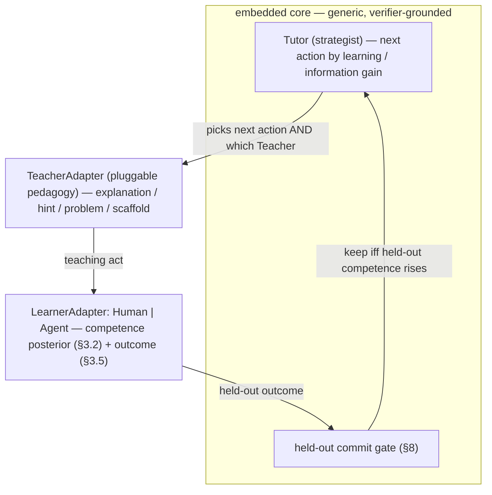

# Algorithm v0.2 — Open-Ended Probabilistic Pathway Learning for Self-Learning Agents (hardened)

**Codename:** Pathway Learner (`PL-v0.2`) · **Date:** 2026-06-22 · **Status:** design spec, no implementation
**Supersedes:** `ALGORITHM-v0.1-pathway-learner.md` (the architecture; same skeleton) after its three-adversary red-team (`ALGORITHM-v0.1-redteam.md`).
**Why v0.2 exists:** v0.1's architecture held up; its *mechanisms* (scalar gates, add-only structures, a single global decay, suite-bound rewards) broke under their own noise and optimizer pressure. v0.2 rewrites the joints.

> **Two principles organize every change below.**
> **P1 — Make the measurement independent of the optimization.** Reward, gate, and calibrate on data the optimizer never touched (held-out splits, counterfactual credit, audit-anchored verifier reliability, cumulative baselines). The optimizer must never be able to move the number without moving the thing the number measures.
> **P2 — Every `add` has an inverse.** Growth that adds skills also merges and prunes them; prereq edges decay; the tree GCs; gates check a cumulative baseline, not just the last step. Add-only + hard gates is a wrong-way ratchet.

---

## 0. What changed from v0.1 (patch traceability)

| Root cause (from red-team) | v0.1 mechanism | v0.2 fix | §  |
|---|---|---|---|
| RC-1 point estimates | scalar `ĉ'≥ĉ−ε` | **one `significant()` gate primitive**: every gate tests Δ against its own SE/CI | §2 |
| RC-2 gameable verifier | pinned suite = reward | **held-out split; reward on held-out delta; trajectory-shape + counterfactual verifiers; audit-anchored `reliability(v)`; anti-hacking imports** | §4 |
| RC-3 unscorable growth | `g` adds bare nodes | **`provision_suite` invariant**: no node enters the live graph without a suite + admitted verifier (else `pending_human`) | §4, §5.1 |
| RC-4 add-only ratchet | no merge/prune; hard-AND reachability | **merge + prune + decaying soft prereqs; soft reachability** | §5 |
| RC-5 over-determined γ | single global decay | **dual posterior (mastery slow / drift fast); per-skill decay; min-`n_eff` cap** | §3 |
| RC-6 stale value tree | re-anchor only `Θ` | **discounted UCT; invalidate tree subtree on checkpoint change; progressive widening** | §7 |
| RC-7 abandoned skills / suite-bound safety | LP-only; eval-suite safety | **coverage floor; reachability-exploration; cumulative + deployment safety + breaker triggers** | §5.3, §8 |
| RC-8 promotion mis-fire | irreversible AND-conjunction post-train | **two-stage reversible promotion; pre-train interference check; scored index; explicit `monitored` set** | §9 |

---

## 1. Objects & notation (deltas from v0.1 in **bold**)

- **Agent-state node** `n = (c, K, L, Θ, z)` — checkpoint `c`, skill library `K`, lessons `L`, competence posteriors `Θ`, cached state embedding `z`.
- **Competence** `Θ = { mastery[s,d], drift[s,d] }` — **two Beta posteriors per `(skill, difficulty)`**: a slow-decay `mastery` (drives selection, promotion, the exploration floor) and a fast-decay `drift` (drives only rollback). (RC-5)
- **Skill states** — `live` (has a provisioned suite + admitted verifier) or **`pending_human`** (created but unscorable; excluded from `reachable`, retrieval, and clustering until a human attaches a verifier). (RC-3)
- **Eval suite per skill** — split into **`public`** (visible to the act path / `ctx`) and **`held_out`** (secret; the only split that drives rewards, gates, and calibration). (RC-2/P1)
- **Verifier registry** `R` — ordered by `reliability(v | difficulty_band)`, each defined against a human audit set (§4).
- **Stores** — hot `{Redis, Graph, Vector}`, cold `{SQL, ObjectStore+Registry, Document}` (§10), plus a `pending_human` queue.

---

## 2. The gate primitive (used everywhere) — fixes RC-1

Every decision that compares competence is a **statistical test against sampling error**, never a scalar compare. One primitive, reused by select / commit / rollback / promote / admit:
```
significant(Δ, se, margin=0, z=2):
    return Δ > margin + z · se            # Δ must clear z·SE (default ~2σ) plus any required margin

SE of a competence delta is computed on PAIRED held-out items (same items before/after),
which cancels shared variance and cuts SE 2–3× vs. independent draws.
LP[s] = posterior SLOPE of mastery over window k   (not a difference of two noisy means)
```
If a quantity can't clear `significant(...)`, it does **not** drive a decision — the system falls back to explicit exploration rather than acting on noise.

---

## 3. State model — fixes RC-1, RC-5

```
mastery[s,d] ~ Beta(αm, βm)     # slow decay γ_slow(s) → 1 as the cell stabilizes
drift[s,d]   ~ Beta(αd, βd)     # fast decay γ_fast(s); reflects "is it regressing right now"

update(cell, successes, failures):
    α ← clamp_decay(γ·α) + successes      # clamp_decay enforces n_eff ≥ n_min  (RC-5: one eval
    β ← clamp_decay(γ·β) + failures       #   can never move ĉ by > ε)
ĉ[s,d]  = αm/(αm+βm)            # competence point (with posterior for SE)
u[s,d]  = Beta_sd(mastery)      # uncertainty → optimism-under-uncertainty exploration (§5.3)
Eff[s]  = running cost-to-success            # efficiency is a first-class, separately-tracked dim
```
- **Decoupled dials (RC-5):** `γ_slow` answers "have I mastered this" (drives promotion + exploration floor); `γ_fast` answers "am I regressing" (drives rollback only). Per-skill, not global. The `n_min` floor means decay can never make a single eval swing `ĉ` more than `ε` — killing v0.1's decay-triggered spurious rollbacks.
- **Cold-start (unchanged):** every new `(s,d)` cell born `Beta(α0,β0)`; never undefined.
- **No false independence:** cells are tied through the soft prereq graph (§5.2) and an optional hierarchical prior across difficulties. IRT remains a drop-in upgrade (same `ĉ/u/update` interface).

---

## 4. Eval harness & verifiers — fixes RC-2, RC-3 (the biggest rework)

The verifier is an incomplete, gameable proxy and the whole system is an optimizer aimed at it. Harden it on all four fronts.

### 4.1 Held-out reward (P1)
```
Eval.score(n, s):
    public  = suite[s].public  @ pinned_version      # visible to ctx; reproducibility only, never rewarded
    secret  = suite[s].held_out @ rotating_sample     # never enters ctx; drives ALL rewards & gates
    r_secret = aggregate( verify(n, item) for item in secret )
    return r_secret, r_public

generalization_gate:  commit/promote requires  Δĉ_secret ≥ ρ_gen · Δĉ_public
    #  public moves but secret doesn't  ⇒  memorization signature  ⇒  reject
```

### 4.2 Trajectory-shape + counterfactual verification (RC-2)
```
verify(n, item):
    output_ok     = assertion(item)                  # necessary, not sufficient
    shape_ok      = trajectory_uses_intended_tools_and_args_from_query(n, item)   # not constants
    counterfactual= passes(item with a freshly-injected variant)  # defeats hard-coded answers
    return output_ok ∧ shape_ok ∧ counterfactual
```
This closes the v0.1-pilot killer (schema-valid / semantically-null tool calls).

### 4.3 Verifier reliability, defined and anchored (RC-2)
```
reliability(v | band) = precision/recall of v vs. a HUMAN AUDIT SET v never trains on,
                        per difficulty band, with a confidence interval
admit(skill s):   ∃ v covering s : reliability_lowerCI(v | current band) ≥ ρ_min   # lower bound, per band
Eval binds to the STRICTEST applicable verifier (no silent downgrade to a softer one)
re-check admission as the agent enters a new difficulty band (admission is continuous, not one-shot)
```

### 4.4 Anti-hacking (import H1's mitigations, omitted in v0.1)
Process-level / ensembled verifiers where available; **human spot-check of the rejection-sampled kept set before any promotion**; KL/regret bounds on weight updates; a "constant-injection rate" detector flags trajectories gaming assertions.

---

## 5. The three meta-functions (hardened)

### 5.1 Growth `g` — provisioning-coupled, with inverses (RC-3, RC-4)
```
g.step(child, F):
    # attribute a failure to an existing cell ONLY if coherent (RC-4: no wrong-cell absorption)
    for traj in child.failures:
        s* = nearest_admitted_skill(traj)
        if coherent_with(traj, s*.success_items):  attribute(traj, s*)
        else:                                       F.add(embed(traj))      # outlier → candidate split

    for cluster in cluster(F):
        if similarity(cluster, nearest_admitted) < τ_new(region):           # adaptive, region-local
            s_new = new_skill(prior=Beta(α0,β0))
            ok = provision_suite(s_new, cluster)                            # INVARIANT (RC-3)
            if not ok: quarantine(s_new → pending_human); continue           # never enters live graph
            add_soft_prereq_edges(s_new, top_k_by_confidence(co_mastery))    # soft, capped fan-in, acyclic

    g.maybe_merge()      # τ_merge > τ_new hysteresis: union evidence of duplicate skills (inverse of split)
    g.prune_orphans()    # retire live skills with no progress after a budget (inverse of growth)
    g.decay_edges()      # prereq-edge confidence decays unless intervention evidence renews it

provision_suite(s_new, cluster):
    v = strictest_inheritable_verifier(nearest_admitted_parent(s_new))
    if v and reliability_lowerCI(v) ≥ ρ_min:
        suite[s_new] = synthesize_items(cluster, gated_by=v) split into {public, held_out}
        return True
    return False        # → pending_human
```

### 5.2 Validity `v` + state-conditioned retrieval — soft + clean + counterfactual (RC-4, RC-2, RC-1, RC-7)
```
reach_weight(s, n) = ∏_{p ∈ prereqs(s)} P(mastery[p] ≥ θ)     # SOFT — probabilistic, never a hard AND
    #  one wrong/decayed prereq dampens but never deletes a skill from the frontier

retrieve(n, task):                                            # hot path; held-out items excluded from ctx
    cand   = Vector.ann(task ⊕ n.z, k=topK)                   # recall (fast, static)
    scored = rerank(cand, score(·|n))                         # state-aware (small set)
    return top_m(scored) ⊕ reachability_exploration(n)        # NOT just novelty — see §5.3

# credit assignment for the learned rerank weights w is COUNTERFACTUAL, not shared (RC-1):
update_w(ctx, r):  for item ∈ ctx: w[item] += marginal_lift(item)   # leave-one-out / randomized dropout
                   w ← w · (1 − l1_decay)                            # passive co-occurrence decays out
```

### 5.3 Frontier policy `π` — normalized, floored, reachability-aware (RC-1, RC-4, RC-7)
```
choose(n, cands):
    cands = soft_reachable(n) ; cands = enforce_coverage_floor(cands)     # every admitted skill ≥ f_min
    for a in cands:
        if spent + cost(a) > budget: continue                            # cost = HARD constraint, not a soft term
        Q̃    = thompson(value_posterior(n, a))                          # optimism-under-uncertainty = exploration
        Uz   = zscore(Q̃ | cands) + λ · zscore(reach_infogain(a) | cands) # normalized, comparable scales
        if not significant(LP_component(a), SE): Uz ← Uz_explore_only(a)  # don't act on noisy LP (RC-1)
        U[a] = Uz
    return argmax U , retrieve(n, argmax.task)
```
- **Soft reachability** replaces the hard `θ` AND-gate → no starvation, robust to one wrong prereq.
- **Coverage floor (RC-7):** every admitted skill is practiced at rate ≥ `f_min` regardless of learning progress → weak spots can't calcify, and `π` can invest in a *prereq* that unblocks the most downstream learning.
- **Reachability-exploration (RC-7):** a term distinct from novelty that samples context/skills by **information gain on unlocking currently-unreachable regions** → defeats the "stale-but-foundational key is invisible" filter bubble.
- **Normalized terms + cost-as-constraint (RC-1):** kills v0.1's λ/μ knife-edge; exploration lives in the posterior (Thompson), not a free additive weight.

---

## 6. The main loop (v0.2)

```
node ← root agent ; G ← open graph
loop forever:
    # 1. SELECT
    a, ctx ← choose(node, reachable_soft(node))          # soft reachability, coverage floor, normalized U, clean ctx

    # 2. EXPAND  (weight actions run on a CLONED checkpoint; KL/regret-bounded)
    child ← apply(a, node, ctx)

    # 3. EVALUATE  (held-out + trajectory-shape + counterfactual, strictest verifier)
    r_secret, r_public ← Eval.score(child, a.target_skills)

    # 4. GROW  (provision-coupled invariant; coherence-gated; merge/prune/edge-decay)
    g.step(child, F)

    # 5. BACKUP  (dual posterior; counterfactual retrieval credit; DISCOUNTED tree)
    update_posteriors(child, a, r_secret)                # mastery(slow) + drift(fast), n_min floor
    update_w(ctx, r_secret)                              # leave-one-out credit
    update_tree_discounted(node, a, r_secret)            # sliding-window UCT (RC-6)

    # 6. COMMIT or ROLLBACK  (statistical + generalization + cumulative + safety)
    if commit_gate(child, node): 
        node ← child
        invalidate(node)                                 # caches AND affected tree subtree on ckpt change (RC-6)
        promotion_review(node)                           # §9, on a cadence (RC-8)
    else:
        rollback(node, rate_limited=True)                # safety-failed branches retain NO fine-grained info (RC-7)
        F.add(child.failures)
```

---

## 7. Backup & non-stationarity — fixes RC-6

- **Discounted UCT:** node value is an exponential-recency average (same `γ` philosophy as §3), not a uniform mean with a never-resetting visit count → old-policy returns age out.
- **Checkpoint-change invalidation:** `invalidate(node)` discounts/resets `value` and `visits` for the **affected subtree**, mirroring the `Θ`/`z` cache invalidation — the v0.1 re-anchor refreshed competence but left the tree poisoned; v0.2 refreshes both.
- **Progressive widening:** new children are admitted only as `N_parent` crosses thresholds and are **prior-initialized** (from the nearest sibling), not 0-visit-infinite → mid-search growth doesn't break the exploration normalization.

---

## 8. Commit, rollback & safety gates — fixes RC-1, RC-7

```
commit_gate(child, node):
    statistical = significant(Δĉ_secret[s], SE, margin=ε)          # RC-1: clear ε + z·SE on held-out
    generalize  = Δĉ_secret ≥ ρ_gen · Δĉ_public                    # RC-2: no memorization
    cumulative  = ĉ_secret[s] ≥ ĉ_baseline[s] − ε_cum              # RC-7: vs a FIXED ancestor, not just parent
    safe        = safety_eval_heldout(child) ≥ pass                # held-out, traffic-drawn, unpredictable items
    return statistical ∧ generalize ∧ cumulative ∧ safe ∧ affordable

rollback fires only on a FRESH, adequately-powered re-eval whose drop clears significant(...)  # RC-5

circuit_breaker trips on ANY of:
    (a) K consecutive rollbacks,
    (b) eval-variance spike,
    (c) PRODUCTION-OUTCOME degradation   # NEW (RC-7): real-task verifier outcomes fed back; closes train/deploy gap
    (d) repeated near-safety-boundary probing  # NEW: the "probing-the-fence" detector
```
- **Cumulative gate (RC-7):** defeats sub-epsilon slow drift (50 commits each within `ε` no longer walk a skill 0.95→0.40 unnoticed).
- **Deployment loop (RC-7):** real trajectories are continuously sampled into the held-out suite, so the safety apparatus is no longer purely suite-bound, and `safety_eval` items are unpredictable (can't be pattern-matched by a sleeper lesson).

---

## 9. Two-stage promotion — fixes RC-8

```
promotion_index(s) = w·[ frequency, behavioral_stability, context_pressure, data_sufficiency, heldout_proven ]
    #  SCORED index crossing one bar — NOT a five-way AND (which never fires).
    #  behavioral_stability is measured on the eval suite, decoupled from γ-decay edit-churn.

promotion_review(node):                                  # runs on a cadence, not only on a rare conjunction
    for s in promotable(node):
        if promotion_index(s) > bar and pre_train_interference(s) < tol:     # cheap Fisher/grad-overlap pre-check
            adapter ← train_LoRA(s)                       # STAGE 1: reversible, detachable
            if sustained_heldout(adapter) ∧ human_spotcheck(kept_set) ∧ no_cum_regression(MONITORED):
                merge_to_base(adapter)                    # STAGE 2: irreversible, fully gated
```
- **Two stages:** a reversible adapter earns its way to an irreversible base merge — converts v0.1's one-way ratchet into a gated, mostly-reversible path.
- **Held-out + counterfactual + human spot-check** before any merge → can't bake an overfit/hacked behavior into weights (RC-8 + RC-2).
- **Pre-train interference prediction** skips likely-regressing promotions *before* paying the train cost (v0.1 checked regression only after the expensive train).
- **`MONITORED`** is an explicit, conservatively-large, versioned set (≥ all promoted skills + a stratified sample) → interference can't hide in an un-watched skill.
- **Scored index** → the weight axis actually fires (v0.1's AND-conjunction was effectively dead).

---

## 10. Data architecture (carried from v0.1, with the RC-6 addition)

Hot read-models `{Redis: frontier+caches, Graph: reachability+MCTS tree, Vector: retrieval/clustering}`; cold truth `{SQL: events/lineage, ObjectStore+Registry: checkpoints/datasets, Document: growing Θ}`; plus the `pending_human` queue. `SQL` is the single source of truth; the rest are disposable projections. **On a checkpoint change, invalidate `Θ`/`z` caches *and* the affected MCTS tree statistics** (the RC-6 fix) — v0.1 invalidated only the former. Checkpoints and the tree get **retention/GC policies** (bounded rewind horizon + tagged milestones) so the eternal loop doesn't blow up storage (RC-4).

---

## 11. Re-scoped pilot (replaces v0.1 §10)

The v0.1 "runnable subset" was where two pilot-killers fired. Stage the pilot so each milestone proves one thing:

- **Milestone 0 — prove the loop measures truth.** Growth **OFF**, fixed skill set, memory axis only, **held-out + trajectory-shape + counterfactual** verifier, statistical commit gate (§2). Domain: tool/function-calling. **Success = held-out competence moves** (the pinned/public number is ignored). This is the real H1 de-risking probe; if held-out doesn't move, stop and fix the verifier.
- **Milestone 1 — turn growth on, safely.** Enable `g` with `provision_suite` + `pending_human` quarantine, soft reachability, merge/prune/edge-decay, decoupled decay. Success = the schema grows *measurable* skills, no orphan sprawl, no oscillation.
- **Milestone 2 — add the weight axis.** Two-stage reversible promotion, discounted/invalidated tree, production-outcome breaker + coverage floor. Success = a promotion improves held-out competence without regressing the `MONITORED` set.

---

## 12. Open parameters to calibrate

`γ_slow, γ_fast` per-skill decays · `n_min` effective-sample floor · `z` significance multiplier · `ε, ε_cum` step/cumulative regression tolerances · `ρ_gen` generalization ratio · `ρ_min` verifier-reliability bar (lower-CI) · `τ_new(region), τ_merge` growth/merge thresholds · `θ` prereq-mastery anchor · `λ` reachability-exploration weight · `f_min` coverage floor · `topK, m` retrieval recall/keep · `l1_decay` rerank-weight decay · `(α0,β0)` cold-start prior · promotion-index weights + `bar` · interference `tol` · `K` breaker count · `k` LP window.

These are the dials a Milestone-0/1 empirical pass tunes. None is guessed in the spec; all are explicit.

---

## 13. The Tutor layer — generic strategist + pluggable Teachers (added 2026-06-26)

*An **additive** layer that sits above §1–§12 without changing any mechanism. It names what the decision core already is — a learner-agnostic **Tutor** — and adds pluggable pedagogy selected by the same held-out gate.*

**Three roles, cleanly separated:**

- **`Tutor` (the strategist) — generic, embedded.** The §3.6 `DecisionEngine`, elevated and renamed. It chooses the next learning action by expected learning/information gain, gated by the held-out verifier (§8). It is **learner-agnostic** and is the one piece that must be **unbiased-by-design** — act on the posterior, favour information gain, decay the past ("don't be a prisoner of past data"). One Tutor serves every learner.
- **`LearnerAdapter` — *who* is taught.** `HumanLearnerAdapter` / `AgentLearnerAdapter`. Exposes the learner's competence posterior (§3.2) and outcome signal (§3.5) in one shape, so the Tutor is identical across humans and agents. For an **agent**, the verifier is execution/schema/task-success (§3.5). For a **human**, it is assessment **plus behavioural signals** (response time, hints used, retries) standing in where a clean execution check doesn't exist — folded into the same posterior.
- **`TeacherAdapter` — *how* a concept is taught.** Pluggable pedagogy: generates the explanation / hint / problem / scaffold. **Deliberately NOT in the core** — domain/modality-specific and not directly verifiable in isolation (the soft-judge trap). Many Teachers may cover one skill.

**The keystone move — the Tutor selects among Teachers by held-out gain.** A Teacher choice is just another `Action` (§1): its effect is measured by the same held-out competence delta and accepted/rejected by the same commit gate (§8). So pedagogy is **learned/selected, not hand-coded**, and stays **verifier-grounded** — one signal improves both the learner *and* the choice of teacher ("the tutor learns from tutoring").



**Integration map (no §1–§12 mechanism changes):**
- `Tutor` ≡ `DecisionEngine` (§3.6) + the info-gain objective (§13.1).
- a Teacher choice flows through EXPAND → EVALUATE → commit-gate (§6, §8) unchanged.
- `LearnerAdapter` wraps `ProbabilisticState` (§3.2) + `EvalHarness` (§3.5); the human variant adds behavioural-signal evidence into the same posterior.
- soft reachability, coverage floor, decay, counterfactual credit (§3–§5) are inherited verbatim.

### 13.1 Information-gain mode — the bias-free objective, made explicit
§3.6 maximises `argmax E[Δcompetence]` (advance the learner). It has a companion for when the bottleneck is **knowing the learner**, not advancing them (thin or possibly-biased data):

```
A* = argmax E[ ΔH ]      # the action that most reduces posterior ENTROPY about the learner
```

The Tutor blends *advance* (Δcompetence) and *diagnose* (ΔH) by the uncertainty the posterior already carries — high uncertainty ⇒ favour the **informative** action, not the **exploitative** one. This is Bayesian **active learning / optimal experiment design**, and it is the formal cure for "biased by past data": the Tutor acts on the open posterior (Thompson, §3.6), and when unsure deliberately picks the action that *corrects its own ignorance* rather than the one the past merely favours.

---

## 14. The calibration layer — trustworthy confidence (added 2026-06-26)

*Additive, like §13 — nothing in §1–§13 changes. The algorithm is uncertainty-**aware** (a posterior everywhere) but not yet **calibrated** (is "80% sure" right 80% of the time?). This layer makes the posterior's SE honest, behind the `ProbabilisticState` port, so every gate/policy that already keys off SE becomes trustworthy with zero change to it.*

**The integration in one line:** calibration is a correction on **effective sample size** — the same dial as the `n_min` floor (§3), but the other direction. `n_min` *inflates* n when data is too thin; calibration *deflates* n when the model is over-confident, widening the SE to match reality.

### 14.1 What the `Calibrator` computes (per skill-difficulty **band**, across learners)
From the held-out stream it pairs each **prediction** `p̂ = E[success]` (logged at decision time) with the **realized** outcome, in a rolling window, and tracks **Expected Calibration Error (ECE)** + **Brier score** (a reliability diagram). It maintains two corrections:
- **Probability recalibration** `g_band`: a monotone map `p̂ → p_cal` (isotonic regression / Platt / temperature scaling) — fixes systematic over/under-confidence in the *point* estimate.
- **Uncertainty recalibration** `c_band ∈ (0,1]`: a multiplier on effective counts — when realized variance > posterior variance (over-confident), shrink `n_eff` so `SE ← SE / √c`. *(The distribution-free, guaranteed-coverage alternative: **conformal prediction** intervals.)*

### 14.2 Where it plugs in (no §1–§13 mechanism changes)
- `ProbabilisticState.estimate()` returns the **calibrated** posterior: mean via `g_band`, SE inflated by `1/√c_band`.
- Everything downstream — `significant()` (§2), Thompson + info-gain (§3.6 / §13.1), the statistical/cumulative commit gates (§8), soft reachability — consumes the calibrated SE **automatically**. Calibration changes none of them; it makes their inputs honest.
- **Data:** log `p̂` at decision time next to the outcome in the truth store (lineage already supports it). Calibration is **per-band** (population), not per-cell — a single learner's single cell never has enough data to calibrate; the cohort does (this is exactly C1's predictive-validity data).
- **Cadence:** recompute `g_band`, `c_band` periodically on the cold path.

### 14.3 As a safety trigger
`ECE_band > τ_cal` trips the **circuit breaker** — a 5th trigger alongside §8's four. Acting on badly-calibrated confidence is precisely how the loop does harm *without* a competence gate firing, so miscalibration is a first-class halt condition.

### 14.4 Relationship to the verifier (C1)
Verifier reliability answers *"is the signal right?"*; calibration answers *"is my confidence in the resulting estimate right?"* — complementary. A miscalibrated verifier *produces* miscalibrated posteriors, so the calibration monitor doubles as a **downstream detector of verifier drift**.

### 14.5 New parameters
calibration window · `c_band` bounds · `τ_cal` breaker threshold · recalibration cadence. *(Formal homes: Platt scaling, isotonic/temperature recalibration, ECE/Brier, conformal prediction.)*

---

## 15. Re-visiting data — the surprise-gated learning loop (added 2026-06-26)

*Additive, like §13/§14. Formalises "the same data point teaches you something new each time you return to it." Rides §2's `significant()` + §13.1's info-gain Tutor + §3/§10's versioned state — no §1–§14 mechanism changes.*

**The core.** An **insight is a prediction error** — the gap between what a data point implies and what the current model expected (Bayesian surprise). Two properties follow: it is **state-dependent** (a moved model → a new gap → a new insight) and it **decays to zero as you assimilate** (once the model predicts the data, no gap remains). So a data point is not a fixed lesson but a **generator** of state-dependent surprise; "infinite pathways in one point" = the infinitely many model-states it can be read from.

### 15.1 Re-derivation as a first-class action
`revisit(D)` joins `apply(a)` as an action the Tutor can select: re-process a stored data point `D` through the *current* state to extract its current surprise. Chosen by the same §13.1 objective — **expected information gain** `E[ΔH | D, state]`.

### 15.2 Trigger — when to re-enter
`revisit(D)` becomes attractive when its expected info-gain clears the bar, which happens when: the **model has moved** since last visit (Δposterior > threshold); a **new input is semantically close** to D (vector) and re-activates it; a **downstream failure** walks back (graph) to D as a root-cause candidate; or **spacing** says the relevant cells are about to be forgotten (decay).

### 15.3 Stop — when to terminate (the natural bound)
The loop self-terminates when re-processing yields no significant gain: **realized gain < threshold** (`significant(ΔH, SE)` fails → assimilated → stop); a **diminishing-returns floor** (K low-gain visits → stop); a **per-revisit budget** (a bounded "8-minute clock" that forces max-info spend and **stops rumination**); and the **circuit breaker** (oscillation/thrash → halt, §14). This is what makes "return endlessly" computable — you *may* revisit any point infinitely, but you only *will* when it's expected to surprise you, and *stop* when it doesn't: **infinity bounded by information, not enumeration.**

### 15.4 Within-episode search (two-level MCTS) — *deterministic domains only*
Where an episode is **replayable** (agents in code/sim domains), `revisit(D)` may run a *search inside D*: re-play the same fixed data point under different actions to find the best move *before committing* — MCTS at the episode level, nested under the §6 graph-level search. *(For live human learning the episode is not replayable; `revisit` degrades to re-reading the record — still the surprise loop, without the clean replay.)*

### 15.5 Two efficiency rules
- **Loops shorten as you assimilate.** As surprise concentrates (per §14's calibrated confidence), skip the already-predicted parts of D and spend the budget only on the high-surprise remainder — re-visit cost shrinks each pass.
- **Negative evidence is information.** A *failed* revisit/eval still reduces uncertainty ("ruled out X"); count it as info-gain and **persist the narrowing**, not just the successes.

### 15.6 Storage — generative, not enumerative
Don't store the infinite paths. A path = `f(D, state@t)`, so store the **generators** — immutable data `D` (truth, §10) + **checkpoint-versioned state** (§3) — and regenerate any path on demand. **Materialise only high-surprise insights** (those clearing the §2 gate) into the skill library + a **graph derivation edge** (so one data node carries multiple realised paths). Finite storage, unbounded paths.

### 15.7 Risks & gates
- **Rumination** (revisit forever) → budget + diminishing-returns floor (§15.3).
- **False insight / confabulation** (a "pattern" that doesn't generalise) → the **verifier + calibration**: an insight is kept only if it raises *held-out* competence (§4, §8), never because it *felt* like one. That gate is the line between genuine insight and self-deception.

---

*Lineage: concept paper → v0.1 (architecture) → red-team (8 root causes) → v0.2 (hardened mechanisms) → Tutor (§13) → calibration (§14) → re-visiting loop (§15), all additive, 2026-06-26. The architecture never changed; the joints did, then the roles were named, the confidence made honest, and the loop made to terminate.*
