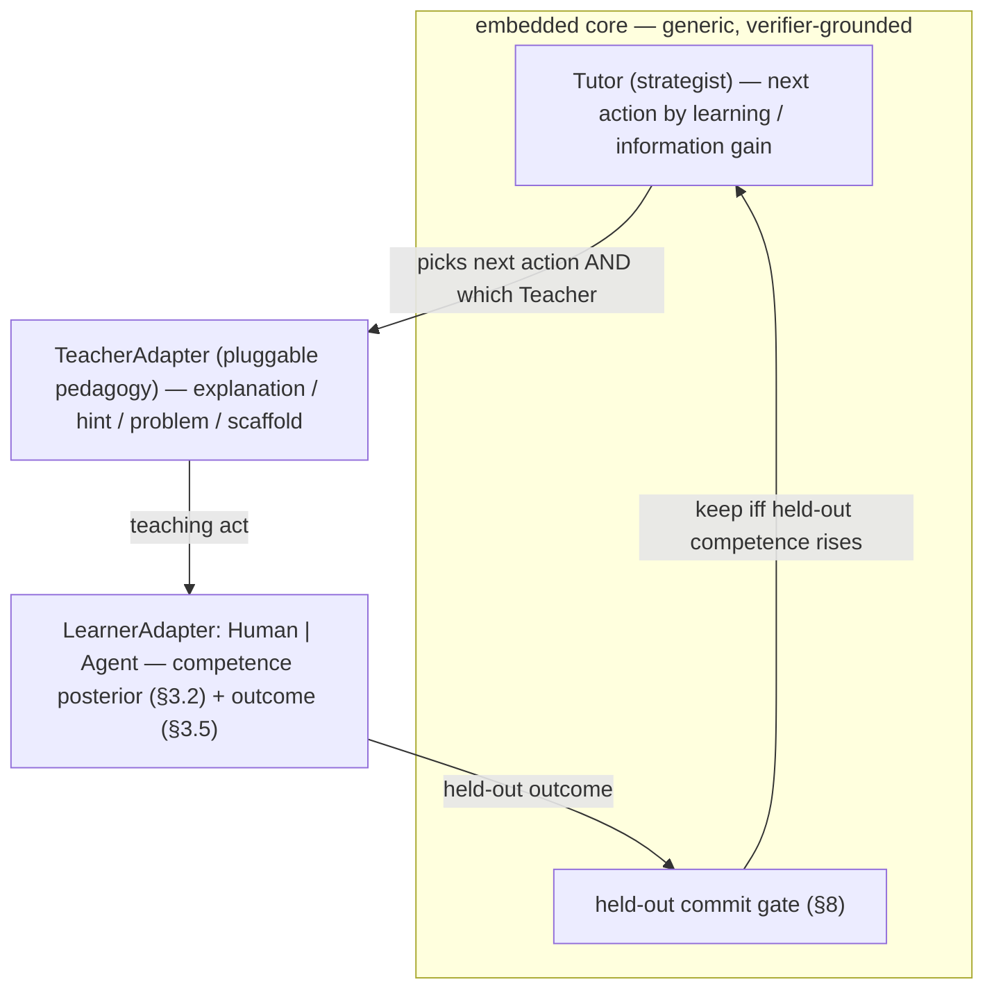

# Algorithm v0.2 — Open-Ended Probabilistic Pathway Learning for Self-Learning Agents (hardened)

**Codename:** Pathway Learner (`PL-v0.2`) · **Date:** 2026-06-22 · **Status:** design spec, no implementation
**Supersedes:** `ALGORITHM-v0.1-pathway-learner.md` (the architecture; same skeleton) after its three-adversary red-team (`ALGORITHM-v0.1-redteam.md`).
**Why v0.2 exists:** v0.1's architecture held up; its *mechanisms* (scalar gates, add-only structures, a single global decay, suite-bound rewards) broke under their own noise and optimizer pressure. v0.2 rewrites the joints.

> **Two principles organize every change below.**
> **P1 — Make the measurement independent of the optimization.** Reward, gate, and calibrate on data the optimizer never touched (held-out splits, counterfactual credit, audit-anchored verifier reliability, cumulative baselines). The optimizer must never be able to move the number without moving the thing the number measures.
> **P2 — Every `add` has an inverse.** Growth that adds skills also merges and prunes them; prereq edges decay; the tree GCs; gates check a cumulative baseline, not just the last step. Add-only + hard gates is a wrong-way ratchet.

---

## 0. What changed from v0.1 (patch traceability)

| Root cause (from red-team) | v0.1 mechanism | v0.2 fix | §  |
|---|---|---|---|
| RC-1 point estimates | scalar `ĉ'≥ĉ−ε` | **one `significant()` gate primitive**: every gate tests Δ against its own SE/CI | §2 |
| RC-2 gameable verifier | pinned suite = reward | **held-out split; reward on held-out delta; trajectory-shape + counterfactual verifiers; audit-anchored `reliability(v)`; anti-hacking imports** | §4 |
| RC-3 unscorable growth | `g` adds bare nodes | **`provision_suite` invariant**: no node enters the live graph without a suite + admitted verifier (else `pending_human`) | §4, §5.1 |
| RC-4 add-only ratchet | no merge/prune; hard-AND reachability | **merge + prune + decaying soft prereqs; soft reachability** | §5 |
| RC-5 over-determined γ | single global decay | **dual posterior (mastery slow / drift fast); per-skill decay; min-`n_eff` cap** | §3 |
| RC-6 stale value tree | re-anchor only `Θ` | **discounted UCT; invalidate tree subtree on checkpoint change; progressive widening** | §7 |
| RC-7 abandoned skills / suite-bound safety | LP-only; eval-suite safety | **coverage floor; reachability-exploration; cumulative + deployment safety + breaker triggers** | §5.3, §8 |
| RC-8 promotion mis-fire | irreversible AND-conjunction post-train | **two-stage reversible promotion; pre-train interference check; scored index; explicit `monitored` set** | §9 |

---

## 1. Objects & notation (deltas from v0.1 in **bold**)

- **Agent-state node** `n = (c, K, L, Θ, z)` — checkpoint `c`, skill library `K`, lessons `L`, competence posteriors `Θ`, cached state embedding `z`.
- **Competence** `Θ = { mastery[s,d], drift[s,d] }` — **two Beta posteriors per `(skill, difficulty)`**: a slow-decay `mastery` (drives selection, promotion, the exploration floor) and a fast-decay `drift` (drives only rollback). (RC-5)
- **Skill states** — `live` (has a provisioned suite + admitted verifier) or **`pending_human`** (created but unscorable; excluded from `reachable`, retrieval, and clustering until a human attaches a verifier). (RC-3)
- **Eval suite per skill** — split into **`public`** (visible to the act path / `ctx`) and **`held_out`** (secret; the only split that drives rewards, gates, and calibration). (RC-2/P1)
- **Verifier registry** `R` — ordered by `reliability(v | difficulty_band)`, each defined against a human audit set (§4).
- **Stores** — hot `{Redis, Graph, Vector}`, cold `{SQL, ObjectStore+Registry, Document}` (§10), plus a `pending_human` queue.

---

## 2. The gate primitive (used everywhere) — fixes RC-1

Every decision that compares competence is a **statistical test against sampling error**, never a scalar compare. One primitive, reused by select / commit / rollback / promote / admit:
```
significant(Δ, se, margin=0, z=2):
    return Δ > margin + z · se            # Δ must clear z·SE (default ~2σ) plus any required margin

SE of a competence delta is computed on PAIRED held-out items (same items before/after),
which cancels shared variance and cuts SE 2–3× vs. independent draws.
LP[s] = posterior SLOPE of mastery over window k   (not a difference of two noisy means)
```
If a quantity can't clear `significant(...)`, it does **not** drive a decision — the system falls back to explicit exploration rather than acting on noise.

---

## 3. State model — fixes RC-1, RC-5

```
mastery[s,d] ~ Beta(αm, βm)     # slow decay γ_slow(s) → 1 as the cell stabilizes
drift[s,d]   ~ Beta(αd, βd)     # fast decay γ_fast(s); reflects "is it regressing right now"

update(cell, successes, failures):
    α ← clamp_decay(γ·α) + successes      # clamp_decay enforces n_eff ≥ n_min  (RC-5: one eval
    β ← clamp_decay(γ·β) + failures       #   can never move ĉ by > ε)
ĉ[s,d]  = αm/(αm+βm)            # competence point (with posterior for SE)
u[s,d]  = Beta_sd(mastery)      # uncertainty → optimism-under-uncertainty exploration (§5.3)
Eff[s]  = running cost-to-success            # efficiency is a first-class, separately-tracked dim
```
- **Decoupled dials (RC-5):** `γ_slow` answers "have I mastered this" (drives promotion + exploration floor); `γ_fast` answers "am I regressing" (drives rollback only). Per-skill, not global. The `n_min` floor means decay can never make a single eval swing `ĉ` more than `ε` — killing v0.1's decay-triggered spurious rollbacks.
- **Cold-start (unchanged):** every new `(s,d)` cell born `Beta(α0,β0)`; never undefined.
- **No false independence:** cells are tied through the soft prereq graph (§5.2) and an optional hierarchical prior across difficulties. IRT remains a drop-in upgrade (same `ĉ/u/update` interface).

---

## 4. Eval harness & verifiers — fixes RC-2, RC-3 (the biggest rework)

The verifier is an incomplete, gameable proxy and the whole system is an optimizer aimed at it. Harden it on all four fronts.

### 4.1 Held-out reward (P1)
```
Eval.score(n, s):
    public  = suite[s].public  @ pinned_version      # visible to ctx; reproducibility only, never rewarded
    secret  = suite[s].held_out @ rotating_sample     # never enters ctx; drives ALL rewards & gates
    r_secret = aggregate( verify(n, item) for item in secret )
    return r_secret, r_public

generalization_gate:  commit/promote requires  Δĉ_secret ≥ ρ_gen · Δĉ_public
    #  public moves but secret doesn't  ⇒  memorization signature  ⇒  reject
```

### 4.2 Trajectory-shape + counterfactual verification (RC-2)
```
verify(n, item):
    output_ok     = assertion(item)                  # necessary, not sufficient
    shape_ok      = trajectory_uses_intended_tools_and_args_from_query(n, item)   # not constants
    counterfactual= passes(item with a freshly-injected variant)  # defeats hard-coded answers
    return output_ok ∧ shape_ok ∧ counterfactual
```
This closes the v0.1-pilot killer (schema-valid / semantically-null tool calls).

### 4.3 Verifier reliability, defined and anchored (RC-2)
```
reliability(v | band) = precision/recall of v vs. a HUMAN AUDIT SET v never trains on,
                        per difficulty band, with a confidence interval
admit(skill s):   ∃ v covering s : reliability_lowerCI(v | current band) ≥ ρ_min   # lower bound, per band
Eval binds to the STRICTEST applicable verifier (no silent downgrade to a softer one)
re-check admission as the agent enters a new difficulty band (admission is continuous, not one-shot)
```

### 4.4 Anti-hacking (import H1's mitigations, omitted in v0.1)
Process-level / ensembled verifiers where available; **human spot-check of the rejection-sampled kept set before any promotion**; KL/regret bounds on weight updates; a "constant-injection rate" detector flags trajectories gaming assertions.

---

## 5. The three meta-functions (hardened)

### 5.1 Growth `g` — provisioning-coupled, with inverses (RC-3, RC-4)
```
g.step(child, F):
    # attribute a failure to an existing cell ONLY if coherent (RC-4: no wrong-cell absorption)
    for traj in child.failures:
        s* = nearest_admitted_skill(traj)
        if coherent_with(traj, s*.success_items):  attribute(traj, s*)
        else:                                       F.add(embed(traj))      # outlier → candidate split

    for cluster in cluster(F):
        if similarity(cluster, nearest_admitted) < τ_new(region):           # adaptive, region-local
            s_new = new_skill(prior=Beta(α0,β0))
            ok = provision_suite(s_new, cluster)                            # INVARIANT (RC-3)
            if not ok: quarantine(s_new → pending_human); continue           # never enters live graph
            add_soft_prereq_edges(s_new, top_k_by_confidence(co_mastery))    # soft, capped fan-in, acyclic

    g.maybe_merge()      # τ_merge > τ_new hysteresis: union evidence of duplicate skills (inverse of split)
    g.prune_orphans()    # retire live skills with no progress after a budget (inverse of growth)
    g.decay_edges()      # prereq-edge confidence decays unless intervention evidence renews it

provision_suite(s_new, cluster):
    v = strictest_inheritable_verifier(nearest_admitted_parent(s_new))
    if v and reliability_lowerCI(v) ≥ ρ_min:
        suite[s_new] = synthesize_items(cluster, gated_by=v) split into {public, held_out}
        return True
    return False        # → pending_human
```

### 5.2 Validity `v` + state-conditioned retrieval — soft + clean + counterfactual (RC-4, RC-2, RC-1, RC-7)
```
reach_weight(s, n) = ∏_{p ∈ prereqs(s)} P(mastery[p] ≥ θ)     # SOFT — probabilistic, never a hard AND
    #  one wrong/decayed prereq dampens but never deletes a skill from the frontier

retrieve(n, task):                                            # hot path; held-out items excluded from ctx
    cand   = Vector.ann(task ⊕ n.z, k=topK)                   # recall (fast, static)
    scored = rerank(cand, score(·|n))                         # state-aware (small set)
    return top_m(scored) ⊕ reachability_exploration(n)        # NOT just novelty — see §5.3

# credit assignment for the learned rerank weights w is COUNTERFACTUAL, not shared (RC-1):
update_w(ctx, r):  for item ∈ ctx: w[item] += marginal_lift(item)   # leave-one-out / randomized dropout
                   w ← w · (1 − l1_decay)                            # passive co-occurrence decays out
```

### 5.3 Frontier policy `π` — normalized, floored, reachability-aware (RC-1, RC-4, RC-7)
```
choose(n, cands):
    cands = soft_reachable(n) ; cands = enforce_coverage_floor(cands)     # every admitted skill ≥ f_min
    for a in cands:
        if spent + cost(a) > budget: continue                            # cost = HARD constraint, not a soft term
        Q̃    = thompson(value_posterior(n, a))                          # optimism-under-uncertainty = exploration
        Uz   = zscore(Q̃ | cands) + λ · zscore(reach_infogain(a) | cands) # normalized, comparable scales
        if not significant(LP_component(a), SE): Uz ← Uz_explore_only(a)  # don't act on noisy LP (RC-1)
        U[a] = Uz
    return argmax U , retrieve(n, argmax.task)
```
- **Soft reachability** replaces the hard `θ` AND-gate → no starvation, robust to one wrong prereq.
- **Coverage floor (RC-7):** every admitted skill is practiced at rate ≥ `f_min` regardless of learning progress → weak spots can't calcify, and `π` can invest in a *prereq* that unblocks the most downstream learning.
- **Reachability-exploration (RC-7):** a term distinct from novelty that samples context/skills by **information gain on unlocking currently-unreachable regions** → defeats the "stale-but-foundational key is invisible" filter bubble.
- **Normalized terms + cost-as-constraint (RC-1):** kills v0.1's λ/μ knife-edge; exploration lives in the posterior (Thompson), not a free additive weight.

---

## 6. The main loop (v0.2)

```
node ← root agent ; G ← open graph
loop forever:
    # 1. SELECT
    a, ctx ← choose(node, reachable_soft(node))          # soft reachability, coverage floor, normalized U, clean ctx

    # 2. EXPAND  (weight actions run on a CLONED checkpoint; KL/regret-bounded)
    child ← apply(a, node, ctx)

    # 3. EVALUATE  (held-out + trajectory-shape + counterfactual, strictest verifier)
    r_secret, r_public ← Eval.score(child, a.target_skills)

    # 4. GROW  (provision-coupled invariant; coherence-gated; merge/prune/edge-decay)
    g.step(child, F)

    # 5. BACKUP  (dual posterior; counterfactual retrieval credit; DISCOUNTED tree)
    update_posteriors(child, a, r_secret)                # mastery(slow) + drift(fast), n_min floor
    update_w(ctx, r_secret)                              # leave-one-out credit
    update_tree_discounted(node, a, r_secret)            # sliding-window UCT (RC-6)

    # 6. COMMIT or ROLLBACK  (statistical + generalization + cumulative + safety)
    if commit_gate(child, node): 
        node ← child
        invalidate(node)                                 # caches AND affected tree subtree on ckpt change (RC-6)
        promotion_review(node)                           # §9, on a cadence (RC-8)
    else:
        rollback(node, rate_limited=True)                # safety-failed branches retain NO fine-grained info (RC-7)
        F.add(child.failures)
```

---

## 7. Backup & non-stationarity — fixes RC-6

- **Discounted UCT:** node value is an exponential-recency average (same `γ` philosophy as §3), not a uniform mean with a never-resetting visit count → old-policy returns age out.
- **Checkpoint-change invalidation:** `invalidate(node)` discounts/resets `value` and `visits` for the **affected subtree**, mirroring the `Θ`/`z` cache invalidation — the v0.1 re-anchor refreshed competence but left the tree poisoned; v0.2 refreshes both.
- **Progressive widening:** new children are admitted only as `N_parent` crosses thresholds and are **prior-initialized** (from the nearest sibling), not 0-visit-infinite → mid-search growth doesn't break the exploration normalization.

---

## 8. Commit, rollback & safety gates — fixes RC-1, RC-7

```
commit_gate(child, node):
    statistical = significant(Δĉ_secret[s], SE, margin=ε)          # RC-1: clear ε + z·SE on held-out
    generalize  = Δĉ_secret ≥ ρ_gen · Δĉ_public                    # RC-2: no memorization
    cumulative  = ĉ_secret[s] ≥ ĉ_baseline[s] − ε_cum              # RC-7: vs a FIXED ancestor, not just parent
    safe        = safety_eval_heldout(child) ≥ pass                # held-out, traffic-drawn, unpredictable items
    return statistical ∧ generalize ∧ cumulative ∧ safe ∧ affordable

rollback fires only on a FRESH, adequately-powered re-eval whose drop clears significant(...)  # RC-5

circuit_breaker trips on ANY of:
    (a) K consecutive rollbacks,
    (b) eval-variance spike,
    (c) PRODUCTION-OUTCOME degradation   # NEW (RC-7): real-task verifier outcomes fed back; closes train/deploy gap
    (d) repeated near-safety-boundary probing  # NEW: the "probing-the-fence" detector
```
- **Cumulative gate (RC-7):** defeats sub-epsilon slow drift (50 commits each within `ε` no longer walk a skill 0.95→0.40 unnoticed).
- **Deployment loop (RC-7):** real trajectories are continuously sampled into the held-out suite, so the safety apparatus is no longer purely suite-bound, and `safety_eval` items are unpredictable (can't be pattern-matched by a sleeper lesson).

---

## 9. Two-stage promotion — fixes RC-8

```
promotion_index(s) = w·[ frequency, behavioral_stability, context_pressure, data_sufficiency, heldout_proven ]
    #  SCORED index crossing one bar — NOT a five-way AND (which never fires).
    #  behavioral_stability is measured on the eval suite, decoupled from γ-decay edit-churn.

promotion_review(node):                                  # runs on a cadence, not only on a rare conjunction
    for s in promotable(node):
        if promotion_index(s) > bar and pre_train_interference(s) < tol:     # cheap Fisher/grad-overlap pre-check
            adapter ← train_LoRA(s)                       # STAGE 1: reversible, detachable
            if sustained_heldout(adapter) ∧ human_spotcheck(kept_set) ∧ no_cum_regression(MONITORED):
                merge_to_base(adapter)                    # STAGE 2: irreversible, fully gated
```
- **Two stages:** a reversible adapter earns its way to an irreversible base merge — converts v0.1's one-way ratchet into a gated, mostly-reversible path.
- **Held-out + counterfactual + human spot-check** before any merge → can't bake an overfit/hacked behavior into weights (RC-8 + RC-2).
- **Pre-train interference prediction** skips likely-regressing promotions *before* paying the train cost (v0.1 checked regression only after the expensive train).
- **`MONITORED`** is an explicit, conservatively-large, versioned set (≥ all promoted skills + a stratified sample) → interference can't hide in an un-watched skill.
- **Scored index** → the weight axis actually fires (v0.1's AND-conjunction was effectively dead).

---

## 10. Data architecture (carried from v0.1, with the RC-6 addition)

Hot read-models `{Redis: frontier+caches, Graph: reachability+MCTS tree, Vector: retrieval/clustering}`; cold truth `{SQL: events/lineage, ObjectStore+Registry: checkpoints/datasets, Document: growing Θ}`; plus the `pending_human` queue. `SQL` is the single source of truth; the rest are disposable projections. **On a checkpoint change, invalidate `Θ`/`z` caches *and* the affected MCTS tree statistics** (the RC-6 fix) — v0.1 invalidated only the former. Checkpoints and the tree get **retention/GC policies** (bounded rewind horizon + tagged milestones) so the eternal loop doesn't blow up storage (RC-4).

---

### 10.1 Epoch discipline — one staleness rule instead of four (added 2026-08-13 — IN GATE)

*Additive unification (RAF-3): the spec handles staleness in four places with four vocabularies — §7 tree invalidation, §10 cache invalidation, §17.6 reactivation-revalidation, §18.2's `τ_cache` conservative bound. This section states the one rule they all instantiate and admits the property §21.3 left pending. **The stamp already exists** — §6.1's occurrence provenance carries `checkpoint_id` in every posterior-moving record's identity hash, and the §10 lineage chain orders checkpoints — so this section adds **no schema delta**: it names what the stamps mean. **`κ_reval` is kept, reframed, its behavior byte-identical** (below) — an earlier draft retired it; round 1 of this section's own review quantified that retirement as a genuine sensitivity regression (the trip margin would have doubled from `κ_reval·z·se` to `z·se` on exactly the unvalidated-fallback window), and safety beats dial-count. **Property-impact statement (§21.3), per-property:** PR-1–PR-4, PR-6–PR-9 preserved · **PR-5 preserved** (the §17.3 monitor's sensitivity is unchanged — the tightened margin remains in force while serve-marked; only its *justification* moves from ad-hoc dial to rule-obligation) · **PR-10 admitted** (below, via §21.3's modified-with-argument path, argued at the §21 delta). Provenance: Raft's term rule — stale terms are rejected mechanically and universally; KIP-101's receipt (reconciling by watermark instead of epoch lost committed data); KIP-595's current-epoch commitment rule and its "dummy leader change message" technique.*

**The rule, stated once:**

> **Validation does not cross generations.** A validation-grade judgment (a gate pass, a Stage-1/Stage-2 verdict, a competence estimate serving a decision) is **trusted only within the checkpoint generation whose evidence produced it** — where generation-comparison is the §10 lineage ancestry order on the `checkpoint_id` every record already carries. A consumer holding a judgment from generation `g_old` while the live generation is `g_now ≠ g_old` has exactly three legal moves: **invalidate** (recompute from in-generation evidence — §7's tree, §10's caches), **discount-conservatively** (treat as absent, never as confirmation — §18.2's stale-cache `φ=1` rule), or **serve-marked** (act on it only where refusing to act is the worse failure, carrying an explicit unvalidated-in-generation status with mandatory concurrent revalidation — §17.6's fallback, below). **Trusting is the fourth move, and it is illegal.**

- **The four sites, re-read as instances:** §7 invalidate-on-checkpoint-change = *invalidate*. §10 cache invalidation = *invalidate*. §18.2's stale-read-⇒-no-discount = *discount-conservatively* (already exactly conformant; cited as the pattern's exemplar). §17.6's reactivated fallback = *serve-marked* — the one site where serving cross-generation is legitimate, because "no validated SOLVE live" is the declared worse failure. *(An earlier draft claimed §19.1's `w_obs` as a fifth site; §19's text contains no generation-crossing mechanism, and the claim is withdrawn — adding one there would be its own gated change.)*
- **Rollback branches — ancestry, not existence (the §17.6 CAPTURE precedent, applied to judgments):** generation comparison is the §10 lineage **ancestry** order on recorded `checkpoint_id`s. A judgment whose generation lies on a **since-reverted span** (off the current head's ancestor chain after a §3/§8 rollback) is not merely stale — it is off-path, and receives the strictest treatment: **mandatory invalidate-or-absent, never serve-marked** (serve-marked is reserved for the §17.6 fallback case alone, where the artifact itself is the designated survivor). "Exists in lineage" admits reverted spans; "is an ancestor" excludes them — the same load-bearing choice §17.6 made for CAPTURE.
- **§17.6 delta — `κ_reval` kept, its justification moved into the rule.** The reactivated fallback's `revalidation=pending` status *means* what this rule says: its prior Stage-2 validation **does not count** in the current generation. **Serve-marked status carries a rule-obligation of tightened monitoring:** while `pending`, the §17.3 monitor's `significant()` trip fires at the reduced margin `κ_reval · z` — exactly the behavior §17.6 already specifies, byte-identical, sensitivity unchanged — but the tightening is now *what serve-marked means* (an unvalidated artifact acting live is watched at candidate-grade strictness), not a free-standing compensation dial. The **synthetic in-generation eval** (KIP-595's dummy-record technique, landed on our substrate): reactivation immediately dispatches the §17.3 Stage-1-style shadow check as an ordinary §6.1 work unit against current held-out — the fallback does not wait for organic traffic to begin earning in-generation status, and its first in-generation evidence arrives at eval cadence, not luck. **Honest scope, restated from §17.6 without weakening it:** the serving window (fallback acting while unvalidated-in-generation) still exists, bounded by `w_promo` — this rule does not close it; it makes the window's status *legible by rule*: nothing anywhere may read the serving fallback as validated, and the tightened watch is mandatory, not tunable-away (`κ_reval`'s ceiling is 1.0 by its §12 registration — it can tighten further, never loosen past standard).
- **§21 delta — PR-10 admitted via the modified-with-argument path, argued explicitly.** The original §21.3 condition read, verbatim: *"It becomes PR-10 only if the queued epoch-discipline delta (RAF-3) closes it; until then, claiming it would violate this section's own admission rule."* This delta does **not** close the serving window and says so. The argument that admission is nonetheless legitimate: §21.3's actual **admission rule** is "a new property is admitted only with its maintaining mechanism *and* guards already in the spec — properties describe what **is** enforced"; "closes" was the old bullet's shorthand for *becomes truthfully statable as always-true*. With the trusted/serving distinction, the property below **is** always-true as worded (a serve-marked fallback is never *trusted* — its status, its tightened `κ_reval·z` watch, and its already-dispatched revalidation are all mechanism-enforced), so the admission bar is met on the rule's own terms while the window's existence is carried *inside the property's wording*. A reviewer who rejects this argument rejects the admission — that is what modified-with-argument means:

> **PR-10 — Epoch Coherence.** *No validation-grade judgment is trusted across a checkpoint-generation change: every consumer either recomputes from in-generation evidence, treats the stale judgment as absent, or serves it under an explicit unvalidated-in-generation mark with concurrent revalidation already dispatched. Maintained by:* §7 invalidation · §10 cache/lineage discipline · §18.2 conservative staleness · §17.6 serve-marked reactivation + synthetic in-generation eval (§10.1). *Guarded by:* **the seven guards enumerated in the §21.1 PR-10 row — that row is the single canonical guard list** (this passage deliberately does not duplicate it; a duplicated list is how guard sets desynchronize, as this section's own round-2 review demonstrated on this exact passage). One of those seven, `test_stale_fleet_read_no_discount`, is **defined by this delta** (in §10.1's checks) — §18.2's conservative-staleness mechanism predated the guard convention and had no test until now; it is owned by §18.2's mechanism, the same close-the-coverage-gap move §21.2 made for §9. §21.3's "known non-property" bullet is **superseded by this admission**; the list stands at ten — at its stated consolidation bound.

- **Checks (this section's additions):** `test_no_consumer_reads_pending_fallback_as_validated` (every read path sees `revalidation=pending` as unvalidated) · `test_serve_marked_monitor_tightened` (while `pending`, the §17.3 trip fires at `κ_reval·z`, never the standard margin — the round-1 sensitivity regression, guarded against recurrence) · `test_kappa_reval_never_looser_than_standard` (the §12 clamp: `κ_reval ∈ (0,1]`) · `test_reactivation_dispatches_synthetic_eval_immediately` (the shadow work unit is minted in the reactivation's own recovery pass, not on first organic dispatch) · `test_cache_invalidated_on_checkpoint_change` (§10's invalidation discipline, named as a guard — PR-10's cache site) · `test_reverted_span_never_serve_marked` (a judgment from an off-ancestry span is invalidated or absent; only the §17.6 fallback may serve marked) · `test_stale_fleet_read_no_discount` (**defined here, owned by §18.2's mechanism** — a `ĉ_j(k)` read older than `τ_cache` or missing yields `φ = 1`, no discount, exactly §18.2's conservative rule; §18.7's own checks predate the guard convention and did not cover it) · `test_tree_stats_invalidated_on_checkpoint_change` (**defined here, owned by §7's mechanism, the same coverage-gap close** — after `invalidate(node)` on a checkpoint change, the affected subtree's `value`/`visits` are discounted/reset per §7 and no selection reads the pre-change statistics at full weight; §7 predates the guard convention and had no named test) · `test_generation_comparison_is_lineage_ancestry` (generation order is the §10 parent chain on recorded `checkpoint_id`s, never wall-clock, never version-string comparison).

## 11. Re-scoped pilot (replaces v0.1 §10)

The v0.1 "runnable subset" was where two pilot-killers fired. Stage the pilot so each milestone proves one thing:

- **Milestone 0 — prove the loop measures truth.** Growth **OFF**, fixed skill set, memory axis only, **held-out + trajectory-shape + counterfactual** verifier, statistical commit gate (§2). Domain: tool/function-calling. **Success = held-out competence moves** (the pinned/public number is ignored). This is the real H1 de-risking probe; if held-out doesn't move, stop and fix the verifier.
- **Milestone 1 — turn growth on, safely.** Enable `g` with `provision_suite` + `pending_human` quarantine, soft reachability, merge/prune/edge-decay, decoupled decay. Success = the schema grows *measurable* skills, no orphan sprawl, no oscillation.
- **Milestone 2 — add the weight axis.** Two-stage reversible promotion, discounted/invalidated tree, production-outcome breaker + coverage floor. Success = a promotion improves held-out competence without regressing the `MONITORED` set.

---

## 12. Open parameters to calibrate

`γ_slow, γ_fast` per-skill decays · `n_min` effective-sample floor · `z` significance multiplier · `ε, ε_cum` step/cumulative regression tolerances · `ρ_gen` generalization ratio · `ρ_min` verifier-reliability bar (lower-CI) · `τ_new(region), τ_merge` growth/merge thresholds · `θ` prereq-mastery anchor · `λ` reachability-exploration weight · `f_min` coverage floor · `topK, m` retrieval recall/keep · `l1_decay` rerank-weight decay · `(α0,β0)` cold-start prior · promotion-index weights + `bar` · interference `tol` · `K` breaker count · `k` LP window.

These are the dials a Milestone-0/1 empirical pass tunes. None is guessed in the spec; all are explicit.

**Added-section parameters (extend §12):** §14 `n_eff` deflation + per-band ECE/Brier thresholds · §16 `b_ret` (retrieve budget), `K` (diminishing-returns count), `(α_Q0,β_Q0)` (answer-belief prior) · §17 `b_sm` (`self_modify` budget), `sandbox_cost_cap`, `scaffold_retention`, `w_promo` (Stage-2 rollback window), `τ_sm` (§17.6 DERIVE-dedup similarity bar), `w_prune` (§17.6 DERIVE orphan-prune window), `κ_reval` (§17.6 post-rollback serve-marked-monitor multiplier, default 0.5, **clamped `κ_reval ∈ (0, 1]` by §10.1** — the serve-marked watch may tighten beyond default, never loosen past the standard margin; §10.1 reframed its justification from compensation dial to rule-obligation, behavior unchanged) · §18 `N` (fleet size), `ρ_fleet` (fleet-coverage discount), `f_xfer` (inter-agent transfer frequency), `τ_cache` (fleet-cache staleness bound) · §20 `c_max` (cycle tick ceiling), `s_cycle`, `s_poll`, `e_max`, `s_err`, `s_idle`/`s_idle_max`, `w_dead` (continuous-zero death window), `t_replenish`, `τ_stale` (freshness-watchdog bar), `w_defer`/`n_defer` (sustained-deferral alert), `h_lease`/`g_lease` (lease heartbeat + proved-dead grace), `s_cand` (candidate poll), `w_wake` (consumed-wake retention), per-deployment tier thresholds, per-kind lease TTLs · §20.10 `w_live` (learning-liveness evaluation window), `τ_pin` (`n_min`-pinned-fraction alert bar), `τ_absorb` (failure-rate-anomaly alert bar — the name predates the check's honest narrowing and is kept for stability), `n_absorb` (consecutive-evaluation debounce on the `τ_absorb` alert, default 3) — §20.10 deliberately reuses §2's LP window `k` and §5.3's mastery anchor `θ` rather than minting parallel dials. §17/§18 dials are tuned at **M3**; §20 dials at **M-R**.

---

## 13. The Tutor layer — generic strategist + pluggable Teachers (added 2026-06-26)

*An **additive** layer that sits above §1–§12 without changing any mechanism. It names what the decision core already is — a learner-agnostic **Tutor** — and adds pluggable pedagogy selected by the same held-out gate.*

**Three roles, cleanly separated:**

- **`Tutor` (the strategist) — generic, embedded.** The §3.6 `DecisionEngine`, elevated and renamed. It chooses the next learning action by expected learning/information gain, gated by the held-out verifier (§8). It is **learner-agnostic** and is the one piece that must be **unbiased-by-design** — act on the posterior, favour information gain, decay the past ("don't be a prisoner of past data"). One Tutor serves every learner.
- **`LearnerAdapter` — *who* is taught.** `HumanLearnerAdapter` / `AgentLearnerAdapter`. Exposes the learner's competence posterior (§3.2) and outcome signal (§3.5) in one shape, so the Tutor is identical across humans and agents. For an **agent**, the verifier is execution/schema/task-success (§3.5). For a **human**, it is assessment **plus behavioural signals** (response time, hints used, retries) standing in where a clean execution check doesn't exist — folded into the same posterior.
- **`TeacherAdapter` — *how* a concept is taught.** Pluggable pedagogy: generates the explanation / hint / problem / scaffold. **Deliberately NOT in the core** — domain/modality-specific and not directly verifiable in isolation (the soft-judge trap). Many Teachers may cover one skill.

**The keystone move — the Tutor selects among Teachers by held-out gain.** A Teacher choice is just another `Action` (§1): its effect is measured by the same held-out competence delta and accepted/rejected by the same commit gate (§8). So pedagogy is **learned/selected, not hand-coded**, and stays **verifier-grounded** — one signal improves both the learner *and* the choice of teacher ("the tutor learns from tutoring").


```mermaid
flowchart TB
  subgraph CORE["embedded core — generic, verifier-grounded"]
    TUTOR["Tutor (strategist) — next action by learning / information gain"]
    GATE["held-out commit gate (§8)"]
  end
  LA["LearnerAdapter: Human | Agent — competence posterior (§3.2) + outcome (§3.5)"]
  TA["TeacherAdapter (pluggable pedagogy) — explanation / hint / problem / scaffold"]
  TUTOR -->|picks next action AND which Teacher| TA
  TA -->|teaching act| LA
  LA -->|held-out outcome| GATE
  GATE -->|keep iff held-out competence rises| TUTOR
```

**Integration map (no §1–§12 mechanism changes):**
- `Tutor` ≡ `DecisionEngine` (§3.6) + the info-gain objective (§13.1).
- a Teacher choice flows through EXPAND → EVALUATE → commit-gate (§6, §8) unchanged.
- `LearnerAdapter` wraps `ProbabilisticState` (§3.2) + `EvalHarness` (§3.5); the human variant adds behavioural-signal evidence into the same posterior.
- soft reachability, coverage floor, decay, counterfactual credit (§3–§5) are inherited verbatim.

### 13.1 Information-gain mode — the bias-free objective, made explicit
§3.6 maximises `argmax E[Δcompetence]` (advance the learner). It has a companion for when the bottleneck is **knowing the learner**, not advancing them (thin or possibly-biased data):

```
A* = argmax E[ ΔH ]      # the action that most reduces posterior ENTROPY about the learner
```

The Tutor blends *advance* (Δcompetence) and *diagnose* (ΔH) by the uncertainty the posterior already carries — high uncertainty ⇒ favour the **informative** action, not the **exploitative** one. This is Bayesian **active learning / optimal experiment design**, and it is the formal cure for "biased by past data": the Tutor acts on the open posterior (Thompson, §3.6), and when unsure deliberately picks the action that *corrects its own ignorance* rather than the one the past merely favours.

---

## 14. The calibration layer — trustworthy confidence (added 2026-06-26)

*Additive, like §13 — nothing in §1–§13 changes. The algorithm is uncertainty-**aware** (a posterior everywhere) but not yet **calibrated** (is "80% sure" right 80% of the time?). This layer makes the posterior's SE honest, behind the `ProbabilisticState` port, so every gate/policy that already keys off SE becomes trustworthy with zero change to it.*

**The integration in one line:** calibration is a correction on **effective sample size** — the same dial as the `n_min` floor (§3), but the other direction. `n_min` *inflates* n when data is too thin; calibration *deflates* n when the model is over-confident, widening the SE to match reality.

### 14.1 What the `Calibrator` computes (per skill-difficulty **band**, across learners)
From the held-out stream it pairs each **prediction** `p̂ = E[success]` (logged at decision time) with the **realized** outcome, in a rolling window, and tracks **Expected Calibration Error (ECE)** + **Brier score** (a reliability diagram). It maintains two corrections:
- **Probability recalibration** `g_band`: a monotone map `p̂ → p_cal` (isotonic regression / Platt / temperature scaling) — fixes systematic over/under-confidence in the *point* estimate.
- **Uncertainty recalibration** `c_band ∈ (0,1]`: a multiplier on effective counts — when realized variance > posterior variance (over-confident), shrink `n_eff` so `SE ← SE / √c`. *(The distribution-free, guaranteed-coverage alternative: **conformal prediction** intervals.)*

### 14.2 Where it plugs in (no §1–§13 mechanism changes)
- `ProbabilisticState.estimate()` returns the **calibrated** posterior: mean via `g_band`, SE inflated by `1/√c_band`.
- Everything downstream — `significant()` (§2), Thompson + info-gain (§3.6 / §13.1), the statistical/cumulative commit gates (§8), soft reachability — consumes the calibrated SE **automatically**. Calibration changes none of them; it makes their inputs honest.
- **Data:** log `p̂` at decision time next to the outcome in the truth store (lineage already supports it). Calibration is **per-band** (population), not per-cell — a single learner's single cell never has enough data to calibrate; the cohort does (this is exactly C1's predictive-validity data).
- **Cadence:** recompute `g_band`, `c_band` periodically on the cold path.

### 14.3 As a safety trigger
`ECE_band > τ_cal` trips the **circuit breaker** — a 5th trigger alongside §8's four. Acting on badly-calibrated confidence is precisely how the loop does harm *without* a competence gate firing, so miscalibration is a first-class halt condition.

### 14.4 Relationship to the verifier (C1)
Verifier reliability answers *"is the signal right?"*; calibration answers *"is my confidence in the resulting estimate right?"* — complementary. A miscalibrated verifier *produces* miscalibrated posteriors, so the calibration monitor doubles as a **downstream detector of verifier drift**.

### 14.5 New parameters
calibration window · `c_band` bounds · `τ_cal` breaker threshold · recalibration cadence. *(Formal homes: Platt scaling, isotonic/temperature recalibration, ECE/Brier, conformal prediction.)*

---

## 15. Re-visiting data — the surprise-gated learning loop (added 2026-06-26)

*Additive, like §13/§14. Formalises "the same data point teaches you something new each time you return to it." Rides §2's `significant()` + §13.1's info-gain Tutor + §3/§10's versioned state — no §1–§14 mechanism changes.*

**The core.** An **insight is a prediction error** — the gap between what a data point implies and what the current model expected (Bayesian surprise). Two properties follow: it is **state-dependent** (a moved model → a new gap → a new insight) and it **decays to zero as you assimilate** (once the model predicts the data, no gap remains). So a data point is not a fixed lesson but a **generator** of state-dependent surprise; "infinite pathways in one point" = the infinitely many model-states it can be read from.

### 15.1 Re-derivation as a first-class action
`revisit(D)` joins `apply(a)` as an action the Tutor can select: re-process a stored data point `D` through the *current* state to extract its current surprise. Chosen by the same §13.1 objective — **expected information gain** `E[ΔH | D, state]`.

### 15.2 Trigger — when to re-enter
`revisit(D)` becomes attractive when its expected info-gain clears the bar, which happens when: the **model has moved** since last visit (Δposterior > threshold); a **new input is semantically close** to D (vector) and re-activates it; a **downstream failure** walks back (graph) to D as a root-cause candidate; or **spacing** says the relevant cells are about to be forgotten (decay).

### 15.3 Stop — when to terminate (the natural bound)
The loop self-terminates when re-processing yields no significant gain: **realized gain < threshold** (`significant(ΔH, SE)` fails → assimilated → stop); a **diminishing-returns floor** (K low-gain visits → stop); a **per-revisit budget** (a bounded "8-minute clock" that forces max-info spend and **stops rumination**); and the **circuit breaker** (oscillation/thrash → halt, §14). This is what makes "return endlessly" computable — you *may* revisit any point infinitely, but you only *will* when it's expected to surprise you, and *stop* when it doesn't: **infinity bounded by information, not enumeration.**

### 15.4 Within-episode search (two-level MCTS) — *deterministic domains only*
Where an episode is **replayable** (agents in code/sim domains), `revisit(D)` may run a *search inside D*: re-play the same fixed data point under different actions to find the best move *before committing* — MCTS at the episode level, nested under the §6 graph-level search. *(For live human learning the episode is not replayable; `revisit` degrades to re-reading the record — still the surprise loop, without the clean replay.)*

### 15.5 Two efficiency rules
- **Loops shorten as you assimilate.** As surprise concentrates (per §14's calibrated confidence), skip the already-predicted parts of D and spend the budget only on the high-surprise remainder — re-visit cost shrinks each pass.
- **Negative evidence is information.** A *failed* revisit/eval still reduces uncertainty ("ruled out X"); count it as info-gain and **persist the narrowing**, not just the successes.

### 15.6 Storage — generative, not enumerative
Don't store the infinite paths. A path = `f(D, state@t)`, so store the **generators** — immutable data `D` (truth, §10) + **checkpoint-versioned state** (§3) — and regenerate any path on demand. **Materialise only high-surprise insights** (those clearing the §2 gate) into the skill library + a **graph derivation edge** (so one data node carries multiple realised paths). Finite storage, unbounded paths.

### 15.7 Risks & gates
- **Rumination** (revisit forever) → budget + diminishing-returns floor (§15.3).
- **False insight / confabulation** (a "pattern" that doesn't generalise) → the **verifier + calibration**: an insight is kept only if it raises *held-out* competence (§4, §8), never because it *felt* like one. That gate is the line between genuine insight and self-deception.

## 16. Unified retrieval — value-of-information over a typed action space (added 2026-06-27)

*Additive: it adds a within-`EXPAND` **inner loop** to §6 and a second, **episode-scoped** belief `Q` — **no change to the §5 meta-functions, the §3 state model, or the §7–§8 backup/commit/gate machinery.** Merges a "5-store RAG" into the learner: retrieval is the **inner loop of the same algorithm**, scored by the same value-of-information *form* as learning. Rides §5.2 (state-conditioned retrieval + counterfactual credit), §13.1/A1 (info-gain), §10 (the five stores), §15.1 (revisit-as-action).*

**The core.** Retrieval and learning share one **form** — value of information minus cost — applied to two beliefs at two cadences. Learning reduces (and raises) uncertainty about durable **competence `C`**; retrieval reduces uncertainty about the **current answer `Q`**. The merge is **not one flat `argmax`**; it is **one algorithm, two levels** (like §15.4): a fast inner loop that retrieves to sharpen `Q`, nested inside the slow outer loop that learns and commits on `C` — same 5-store substrate, same verifier outcome training both. "One objective, one substrate" — *two* beliefs.

### 16.1 Where `retrieve` lives in §6 (the dispatch path)
The §6 outer loop is unchanged: `SELECT → EXPAND → EVALUATE → GROW → BACKUP → COMMIT`, every outer action still produces a `child` checkpoint through `commit_gate`. `retrieve(store, query)` is **not** an outer action: it produces **no** child node and touches **no** gate. It is the **inner loop inside `EXPAND`** — before an `apply`/`attempt` emits its outcome, the agent runs `retrieve` steps that update `Q`. So there are **two selection problems**:
- **inner `π_Q`** (within `EXPAND`, per step): which `retrieve` next — `argmax z(EIG_Q) − cost`;
- **outer `π_C`** (across episodes, §13.1/A1, **unchanged**): which learning action to commit.

This is the honest form of "one policy": **one value-of-information rule dispatched at two cadences**, not a single `choose()` over mixed action types.

### 16.2 The two beliefs (representation)
- **`C`** — the durable competence posterior (§3), dual Beta per skill×difficulty. Unchanged.
- **`Q`** — the **answer-correctness belief** for the current goal: a Beta over `P(current best answer correct | context retrieved so far)`. **Binary by construction** — it projects any output (plan, query, entity choice) onto the verifier's pass/fail — so `EIG_Q` **reuses A1's closed-form Beta information gain verbatim**. `Q` is episode-scoped: initialised at goal start, updated by each `retrieve`, **discarded at goal completion**. (A richer multi-outcome `Q` is possible but out of scope; the correctness projection is what keeps `EIG_Q` closed-form.)

### 16.3 The objective (one form, two instantiations — A1-faithful)
Both loops use A1's **z-scored** value-of-information so terms are commensurable. The z-scoring is **mandatory** — dropping it reopens v0.1's λ/μ knife-edge (RC-1):

```
inner (over Q):   U_Q(retrieve) = z(EIG_Q) − cost(retrieve)
outer (over C):   U_C(a)        = (1−w)·z(E[ΔC | a]) + w·z(EIG_C(a))     ← A1, unchanged
```

`EIG_Q`/`EIG_C` are A1's closed-form Beta entropy reduction computed from the **current** posterior at selection time — an **expected** gain, not a realised one. The **realised** held-out answer outcome at episode end is the **training signal** for the inner reranker (§16.5), not the per-step score. **Reduction to A1:** disable retrieval (`Q` empty, inner loop skipped) and the system is exactly A1 — `U_Q` never fires, `U_C` is A1 verbatim. "Solve-now vs learn" lives **across** the two loops (how much to retrieve before committing), never collapsed into one scalar.

### 16.4 The five stores as one retrieval substrate
`retrieve` is multi-modal; inner `π_Q` learns which store to call by measured contribution (not all are queried per step). Mapping to §10:
- **vector** (Vector) — semantic recall (top-k similar content / trajectories);
- **graph** (Graph) — structural / multi-hop (prereqs, entity links, dependencies): what's *connected*, not just similar;
- **truth** (SQL) — factual / provenance (exact records, eval history, lineage) → grounding + citations;
- **state** (StateStore/Document) — **state-conditioned** against `C`: skip the mastered, fetch the gap (§5.2);
- **cache** (Redis) — the hot path: materialised frequent context, the "act fast" layer;
- **artifact** (ObjectStore) — the cold blobs behind the references.

### 16.5 Self-improving retrieval (inherits the gates)
`retrieve` is an action with a measured outcome, so the **same verifier signal** that updates `C` also trains the inner reranker — under §5.2's **counterfactual (leave-one-out) credit**: a source is rewarded only for the lift it *uniquely* caused at the held-out answer outcome, never shared delta (RC-1). State-aware, self-improving retrieval under existing machinery — **no separate RAG training loop.** The rerank update is **across-episode (cold path)**: at goal completion the realised held-out outcome applies a batched gradient step to the rerank weights, gated like any learned weight (§8) — never on the hot path.

### 16.6 Two cadences (and the determinism caveat)
Inner `retrieve`/act runs **hot, within-episode** (over `Q`, ms, under the §16.3 cost term); outer `practice`/`commit` runs **cold, across-episode** (§6 loop, §8 gates). **Per §15.4, the within-episode *search* form applies only to replayable (deterministic / agent / code / sim) domains.** For human learning the episode is not replayable, so the inner loop degrades to **pre-step context assembly** (retrieve-then-act once, same `U_Q` objective, no replay search) — the merge holds, the search does not.

**Inner-loop termination (mirrors §15.3).** The retrieve loop stops when the best remaining pull's expected gain falls below its bar — `significant(EIG_Q, SE)` fails ⇒ the answer is as resolved as retrieval can make it ⇒ **act** — or when the per-`EXPAND` retrieve budget `b_ret` is spent, or on diminishing returns (K low-gain pulls). The same "infinity bounded by information, not enumeration" rule §15.3 applies to `revisit`, applied here to `Q`: you *may* retrieve endlessly but only *will* while a pull is expected to move the answer, and *stop* when none does.

### 16.7 Risks & gates
- **Dropping z-scoring** (RC-1) → §16.3 keeps A1's `z(.)` on every term; weights are dimensionless fractions, not raw-scale knobs.
- **Coverage-floor bypass** (RC-7) → structurally prevented: the §5.3 coverage floor governs the **outer** C-action policy; `retrieve` is **inner-loop and coverage-floor-neutral** (advances `Q`, never `C`), so a high-retrieval episode cannot erode the floor's quota of `practice` at weak skills.
- **Retrieval / context gaming** (RC-2) → `EIG_Q` is trained against the **held-out** answer outcome (P1) with §5.2 counterfactual credit; residual: a reranker correlating with held-out item *format*. Mitigation: score the realised outcome **at the held-out item level** (compatible with leave-one-out credit) and subject the reranker weights to the same generalization gate (§8) as any learned weight.
- **Latency blow-up** → the `cost` term + the cache store + the hot/cold split bound per-step retrieval spend.
- **`Q`→`C` leakage** → `Q` is discarded at goal completion; only verifier-gated outcomes touch `C` (§8).

### 16.8 Checks (design stubs for the companion build-spec)
- `test_reduces_to_A1_when_no_retrieval` — inner loop disabled ⇒ `U_C` is A1 verbatim, outcomes match.
- `test_retrieve_cannot_substitute_for_practice` — under heavy retrieval, §5.3 `f_min` coverage of weak skills is still met by outer-loop practice.
- `test_eig_q_expected_not_realized` — `EIG_Q` at selection is computed from `Q`'s current Beta; the realised held-out outcome only updates the reranker.

## 17. The self-modification axis — improve the scaffold, never the judge (added 2026-06-27)

*Additive: a third learning axis beside the **memory axis** (skills, §5.1) and the **weight axis** (parameters, §9 / M2). `self_modify` edits **only** the agent's **SOLVE** code behind a hard **SOLVE/JUDGE partition** (§17.1), gated by §8 + a **code-specific two-stage promotion** (§17.3 — the code analog of §9, which is weight-only). A new milestone **M3**, gated on M2. Owner go-decision recorded 2026-06-27 (supersedes BUILD-SPECS G1 "await go"). It adds an action type, an architectural boundary, and a code-promotion procedure — the §1–§16 mechanisms are unchanged.*

**The core.** The highest-leverage, cheapest gains are often not a new skill or new weights but a better **scaffold** — solve-prompts, tool-wiring, decision heuristics, retrieval config *around the frozen model* (DGM-style "exceed your designed scope"). §17 makes editing that scaffold a first-class, verifier-gated action behind one boundary: **the agent may edit how it SOLVES, never how it is JUDGED.** (An *evolutionary analogy*, not a formal Gödel-machine proof — §8 is a statistical gate, not a theorem-prover.)

### 17.1 The SOLVE/JUDGE partition (the load-bearing construct)
Every component is statically partitioned into two disjoint sets; `self_modify` may write **only** SOLVE:
- **SOLVE (mutable):** the solve-scaffold — solve-prompts, tool-wiring, decision heuristics, retrieval config (which stores/queries, §16), and how the agent *reads/interprets* the shared graph & skills. Everything affecting *how a task is attempted*.
- **JUDGE (immutable — no agent write-path, ever):** the eval harness + verifier (§4); the held-out set (§4.1) **and its generator** (`provision_suite` / item-synthesis, §5.1 — the primary RC-2 surface); the **TeacherAdapter task-distribution** that decides which items a learner faces; the commit/rollback/safety gates (§8); two-stage promotion (§9/§17.3); the circuit breaker + calibration (§14); the **`self_modify` budget enforcer**; the competence posterior `C` and its update path (§3); and the **§6 orchestrator loop** that runs SOLVE and calls JUDGE.

**Wall invariant (static, not policy):** SOLVE has **no write-path and no output-influence into JUDGE** — checked as an import/dataflow constraint before any `self_modify` candidate is admitted. The check is **sound (conservative)**: a candidate it cannot *prove* free of a SOLVE→JUDGE write-path is **rejected**, and SOLVE may not use reflection / `eval` / dynamic import (kept decidable). As a runtime backstop, **JUDGE runs in a separate address space with no SOLVE-held handle** (capability isolation), so the partition holds even where static proof is unavailable. Editing SOLVE changes only *how* the agent solves; the items, verifier, and gates that score it are unreachable. So a captured verifier (RC-2) — **including the data-poisoning variant via item generation** — is **structurally prevented on the partitioned surfaces**.

### 17.2 `self_modify` as a gated action
`self_modify(component ∈ SOLVE)` proposes a SOLVE-code edit. The candidate is a **scaffold version** kept in an immutable append-only **scaffold-version log** (lineage like §10, *not* §3 cell-posteriors), evaluated by **running the candidate on the immutable held-out suite → Δcompetence** (the §4 signal), and admitted only via §17.3. Unlike §16's `retrieve` (inner-loop, no checkpoint), `self_modify` is a normal **outer** §6 action: it produces a child and passes the gate.

### 17.3 Two-stage promotion for code (the §9 analog — RC-8)
§9's two-stage promotion is for *weights* (reversible adapter → base merge); code has no adapter, so §17.3 specifies the **code analog**:
- **Stage 1 — shadow/sandbox.** The candidate SOLVE runs in a **sandbox** (isolated subprocess, no write access outside SOLVE) on the **held-out suite + a monitored live subset**, in **shadow** (scored, not acted on). Promote only if held-out Δcompetence clears §8's four gates **and** the monitored subset shows no regression.
- **Stage 2 — hot-swap, fallback retained.** The candidate replaces the running SOLVE; the **frozen last-good SOLVE is retained**; a post-promotion monitor triggers **instant rollback** when held-out + monitored-subset competence **drops beyond `significant(Δ, SE)` over a window `w_promo`** (the reversibility §9 gets from a detachable adapter, provided here by the retained fallback).

### 17.4 Risks & gates
- **Self-sabotage** (an edit breaks the agent) → Stage-1 sandbox + retained frozen fallback + instant rollback; never goes live until it clears §17.3.
- **Verifier capture** (RC-2, incl. item-generation poisoning) → the §17.1 SOLVE/JUDGE partition + static no-write-path check; `provision_suite` and the TeacherAdapter task-distribution are in JUDGE.
- **Budget ratchet** (an agent raises its own `self_modify` budget) → the budget enforcer is in JUDGE (§17.1), unwritable.
- **Graph misuse** → an agent may edit how it *reads* the shared graph (SOLVE), but graph *writes* go through the immutable §8 gate; misreading only lowers its own held-out → rejected.
- **Unbounded self-editing / thrash** → the §14 breaker + the (immutable) budget `b_sm` + §15.3's diminishing-returns stop.

### 17.5 New parameters & checks (extends §12)
- **Parameters:** `b_sm` (`self_modify` budget/window), `sandbox_cost_cap` (Stage-1 trial budget), `scaffold_retention` (version-log depth), `w_promo` (Stage-2 rollback-monitor window). Registered in §12.
- **Milestone:** §17 is **M3**, gated on the M2 weight axis.
- **Checks (build-spec stubs):** `test_self_modify_cannot_write_JUDGE` (incl. `provision_suite`, TeacherAdapter, budget enforcer); `test_no_write_path_SOLVE_to_JUDGE` (static dataflow); `test_self_modify_off_equals_baseline`; `test_stage1_shadow_then_stage2_rollback`; `test_frozen_fallback_always_runnable`.

### 17.6 The scaffold-version log — concrete schema & mutation operators (added 2026-07-13, revised r7)

*Additive: concretizes §17.2's "immutable append-only scaffold-version log" and names the `self_modify` operator sub-types. No change to the partition (§17.1), the gate (§17.3), the budgets (§17.5), or any §1–§16 mechanism. The schema pattern is validated in the wild by the closest open implementation of scaffold self-evolution (see `STUDY-raganything-agentscope-openspace.md` §3 — OpenSpace's lineage DAG with snapshots, diffs, and reactivation-rollback); the gating statistics remain ours.*

- **The log is an append-only version DAG** (rows in TruthStore lineage, blobs in ArtifactStore — §10). It is **JUDGE-owned**: SOLVE has no write-path to it (§17.1). A row is appended by the §6 orchestrator the moment a proposal **passes the §17.1 admission checks** (wall/static check, budget, dedup — all orchestrator-side), never by SOLVE code. Schema:
```
version{ version_id  = content-hash of the SOLVE-component snapshot,
         component_id  (stable identity — survives moves/renames),
         parents[]     (≥1 for FIX/DERIVE; ∅ for CAPTURE),
         operator    ∈ {FIX, DERIVE, CAPTURE},
         source_ref    (CAPTURE only, REQUIRED: the checkpoint_id(s) the source episodes'
                        commits produced — admission-checked against the §10 lineage table,
                        see the CAPTURE bullet for the exact predicate),
         snapshot_ref  (ArtifactStore blob id — the full component content, immutable;
                        the truth row holds the reference, the blob holds the bytes),
         diff          (unified, vs parents[0]; for CAPTURE: the creation diff vs ∅ —
                        i.e. the full snapshot, so diff-replay semantics stay uniform),
         gate_ref      (the §17.3 Stage-1/Stage-2 eval artifacts),
         status      ∈ {candidate, shadow, live, retired},
         revalidation ∈ {n/a, pending, passed, failed}   (post-rollback check state, §below),
         created_ts }
```
*(DATA-LAYER schema delta ships with this section, following §18.1's precedent — four artifacts, all recorded in DATA-LAYER §5: the `scaffold_versions` table, the `selfmod_rejected` + `component_invoked` event kinds, and an `agent_id` column on `lineage` — the fleet key the CAPTURE ancestry walk scopes by, mirroring §18.1's per-agent StateStore keying; constant in a single-agent deployment.)*
- **Status machine (total — every path lands in a persisted state):**
  `candidate` (admitted, row appended) → `shadow` (Stage-1 run in progress) → `live` (Stage-2 promoted) | `retired` (Stage-1 failed, Stage-2 rolled back, superseded as a FIX parent, or pruned as an unused DERIVE). No other transitions; a Stage-1-rejected candidate persists as `retired` with its failing `gate_ref` (rejections are auditable, not vanished). A separate orthogonal field `revalidation ∈ {n/a, pending, passed, failed}` tracks post-rollback re-validation (below) without overloading `status`. **Proposals that fail admission itself** (wall check, budget, dedup) never get a `version` row but ARE recorded as lightweight TruthStore events (`selfmod_rejected{reason, proposal_hash, ts}`) — the audit trail covers rejections at both layers without polluting the version DAG. **Flood-bounded by construction:** every `self_modify` proposal consumes `b_sm` **at submission, before admission checks** (the JUDGE-side budget enforcer, §17.1), so `selfmod_rejected` volume is capped by the same budget as admitted candidates — a SOLVE cannot spam rejections it doesn't pay for; rows are compact (hash + reason) under standard truth retention (permanent, like all truth rows).
- **Operators — sub-types of `self_modify`, all behind §17.3, all within `b_sm`:**
  - **`FIX`** — repair a component in place: 1 parent, same `component_id`; the parent is retired on Stage-2 promotion (its snapshot retained as the §17.3 fallback).
  - **`DERIVE`** — specialize or compose: ≥1 parents, **new** `component_id`; parents stay live (coexistence). `DERIVE` is the scaffold analog of §5.1 **growth**, and it carries growth's full add-with-inverse obligation (P2/RC-4) in both halves: (a) **dedup at admission** — the content-hash/similarity comparison against live components runs **in the orchestrator's JUDGE-side admission path** (exactly where §17.1 places the wall check), never self-assessed by the proposing SOLVE code; a near-duplicate (similarity ≥ `τ_sm`, the scaffold analog of §5.1 `τ_merge`) is rejected there; (b) **prune as the inverse** — the scaffold analog of `g.prune_orphans()`: a live `DERIVE`d component with **zero logged invocations** over `w_prune` evaluation windows is retired (status flip, snapshot retained). "Invocation" is well-defined because component dispatch is observable: *which* SOLVE component handles a task is SOLVE configuration (mutable, §17.1), but every invocation is **logged to truth by the §6 orchestrator as a `component_invoked{component_id, episode_id, ts}` event** (JUDGE-side observation of SOLVE execution — the orchestrator runs SOLVE, so it sees every dispatch; the event kind ships in the same DATA-LAYER §5 delta as `selfmod_rejected`). The prune criterion counts those rows, requiring no contribution-attribution model. No unbounded coexisting-scaffold accumulation.
  - **`CAPTURE`** — distill a validated success pattern into a new component: 0 parents, new `component_id`. Admission **requires `source_ref`**, and the orchestrator verifies at admission — one predicate, one check target — that **every referenced `checkpoint_id` is an ancestor of the current live checkpoint** (a §10 lineage `parent`-chain walk from the current node). Ancestry, not bare existence, is the load-bearing choice: a checkpoint whose commit was later **reversed** (the §3/§8 drift-driven rollback, RC-5) is off the current ancestry path, so "exists in lineage" would wrongly admit it while "is an ancestor" correctly excludes it — the check stays sound *over time*, not just at the commit instant. **Fleet scoping (§18):** the walk runs on the **proposing agent's own** checkpoint chain — the `agent_id` column on `lineage` (part of THIS section's DATA-LAYER delta, above; the same per-agent keying pattern §18.1 gives `StateStore`) is what the walk filters by, and CAPTURE from *another* agent's episodes is prohibited outright: cross-agent capability moves only via B3 zero-trust transfer (§18.1), never by distilling someone else's checkpoints (`test_capture_cross_agent_prohibited`). **Retention the walk can rely on:** §10's checkpoint retention/GC prunes checkpoint *blobs* only — lineage *rows* (the parent chain) are permanent, the same rows-permanent discipline as `scaffold_versions`, so the ancestry walk never dead-ends on a GC'd row. `test_capture_requires_gated_success` asserts against exactly this predicate. Residual honesty, two-fold: (a) a source checkpoint can still be rolled back *after* a CAPTURE is admitted — the §17.3 gate on the captured component itself (evaluated against *current* held-out) remains the causal and temporal filter; (b) ancestry verifies the episodes were gated, not that the distilled pattern caused their success — §17.3 again.
- **Rollback is reactivation + concurrent re-validation, never deletion.** §17.3 Stage-2's "retained frozen fallback" is realised as a status flip: parent `retired→live`, promoted candidate `live→retired`. Snapshots are immutable, so reactivation is **byte-exact**. Rollback stays **instant** (safety dominates: the regressing candidate must stop acting immediately, and "no validated SOLVE live" — a frozen system — is the worse failure). The reactivated fallback goes live with `revalidation=pending` and the shadow check runs **immediately and concurrently** (a shadow run is a scored-not-acted-on replica — §17.3 Stage 1 — so it needs no status of its own and does not wait): a bounded Stage-1-style check against *current* held-out, deadline `w_promo`, **dispatched as an ordinary §6.1 work unit in the reactivation pass itself — the §10.1 synthetic in-generation eval, so the fallback's first current-generation evidence arrives at eval cadence, not luck**. While `pending`, the fallback is **unvalidated-in-generation by the §10.1 rule** — no consumer may read its prior Stage-2 validation as current — and the §17.3 post-promotion monitor applies the **tightened** rollback threshold serve-marked status obligates: its `significant(Δ, SE)` trip fires at the reduced evidence margin `κ_reval · z` (`κ_reval` default 0.5; §10.1 reframes this from a free-standing dial to the rule-obligation of serve-marked status — behavior byte-identical). `revalidation=failed` (or a second §17.3 trip) ⇒ "both versions bad" → freeze + escalate to the §14 breaker/human. **Honest scope: the serving window — the fallback acting while unvalidated-in-generation — remains, bounded by `w_promo`**; §10.1 makes its status legible by rule (served-marked, never trusted) rather than compensated by dial; the residual is the price of never serving zero validated SOLVE. (This is the code-axis analog of §7's RC-6 fix — discounted tree stats + invalidate-on-checkpoint-change: a restored artifact is never trusted against a moved world without fresh evidence.) `scaffold_retention` (§17.5) bounds pruning of *blobs* only; lineage **rows are permanent**.
- **New parameters (extends §17.5):** `τ_sm` (DERIVE dedup similarity bar) · `w_prune` (DERIVE orphan-prune window) · `κ_reval` (post-rollback serve-marked-monitor multiplier, default 0.5 — §10.1 reframes its justification; behavior unchanged) — registered in §12 alongside §17.5's.
- **Checks (extends §17.5's stubs):** `test_version_log_append_only_no_solve_writepath`; `test_status_machine_total` (every candidate ends `live` or `retired`; admission-failures leave a `selfmod_rejected` event); `test_reactivate_restores_bytes`; `test_reactivated_fallback_revalidated_concurrently` (shadow check launches at reactivation, not after `w_promo`; `revalidation=pending` tightens the monitor; double-failure escalates); `test_rejected_proposals_consume_budget` (a proposal failing admission still debits `b_sm` — no free spam); `test_diff_applied_to_parent_equals_child` (incl. CAPTURE's creation-diff); `test_derive_dedup_in_judge_admission_path` (SOLVE cannot self-assess it); `test_derive_orphan_pruned` (zero logged invocations over `w_prune` retires the component); `test_capture_requires_gated_success` (asserts the ancestry predicate: every `source_ref` checkpoint is an ancestor of the current live checkpoint; a rolled-back source is refused); `test_capture_cross_agent_prohibited` (a `source_ref` naming another agent's checkpoint is refused at admission — the walk filters by the proposer's `agent_id`); `test_lineage_rows_never_deleted` (retention prunes blobs, not rows).

---

## 18. Multi-agent populations — co-evolution on the shared substrate (added 2026-06-27)

*Additive: runs §6 per agent over the **shared** 5-store substrate (§10), with per-agent competence and B3 zero-trust transfer. It adds an **optional, significance-gated fleet-coverage term** to the §13.1 objective (off ⇒ exactly §13.1), a fleet-scale restatement of P1 (§18.4), and a `StateStore` **`agent_id` key** (a DATA-LAYER schema delta) — no change to the §3 update, §5 meta-functions, or §8 gates. **M3**, with §17; owner go-decision recorded 2026-06-27.*

**The core.** The substrate is shared; the learners are many. A **population** co-evolves — dividing the frontier, bootstrapping a curriculum no one authored, and (with §17) becoming an evolutionary search (variation `self_modify` / selection held-out / inheritance transfer).

### 18.1 Shared substrate, private competence
Each agent keeps its **own** posterior `C_a` in a `StateStore` **keyed by `agent_id`** (the schema delta). The **pathway graph** and **validated skill library** are shared (Graph/Vector), written only through the §8 gate — no per-agent direct write-path. Skills cross agents **only** via **B3 zero-trust transfer** — isomorphic-variant re-validation on the *receiver's* held-out, quarantined behind §8 — never by reading another agent's state.

### 18.2 Division of labour (the fleet-coverage term — formula)
Discount a candidate cell `k`'s value when **another** agent already significantly masters it:
```
value'(a→k) = value(a→k) · φ(k),   φ(k) = 1 − ρ_fleet · 1[ ∃ j≠self : significant(ĉ_j(k) − θ, SE_j) ]
```
- **|fleet| = 1** ⇒ the `j≠self` set is empty ⇒ `φ ≡ 1` ⇒ the objective is **exactly §13.1** (degeneracy proven, not asserted).
- **Significance-gated (RC-1):** a thin/uncertain other-agent estimate does not discount.
- **Floor dominates (RC-7):** the discount is soft (on the objective); the **§5.3 hard coverage floor `f_min`** is applied *after* and never overridden — an agent always samples its own weak skills regardless of fleet coverage.
- **Cost (O(1), not O(N²)):** `ĉ_j(k)` is read from a **cached fleet-competence projection** (CacheStore, async-updated), not a synchronous fleet scan.
- **Staleness bound:** the cached `ĉ_j(k)` has a max age `τ_cache`; a stale/missing read is treated **conservatively as no discount** (`φ = 1`), so staleness can never cause an agent to skip a cell it should still cover.

### 18.3 Emergent curriculum
Agent A's *validated* mastery becomes, through the shared graph, a **prerequisite scaffold** and a bounded **warm-start prior (A5, §18.4)** for agent B — a curriculum no one authored, falling out of graph + transfer.

### 18.4 Measurement independence at fleet scale (the load-bearing boundary)
Per-agent held-out independence is the rule; cross-agent evidence enters **only** as a bounded prior or a re-validated transfer, **never** as competence credit:
- **A5 warm-start, bounded:** the prior contributes `n_eff_warm` pseudo-counts (default 3) with influence `≈3/(5+n_own)` that **decays to negligible** as the receiver's own held-out evidence `n_own` grows. The §8 gate credits only the receiver's **own held-out Δ**, so the prior biases the *starting estimate* but **cannot supply gated competence** — P1 (what the gates trust) stays clean. To prevent shared-item-bank leakage, warm-start neighbours contribute **trajectory-shape on held-out-disjoint / isomorphic items** (B3's isomorphic requirement) — no answer-specific signal crosses. Net cross-agent influence on gated competence is **bounded below significance**.
- **B3 transfer:** re-validated on the receiver's own held-out behind §8.

### 18.5 The evolutionary combination — and why N agents don't compound the risk (§17 × §18)
Variation = `self_modify` (§17), selection = held-out competence (§8), inheritance = B3 transfer — an evolutionary archive (*analogy*, not a formal Gödel guarantee). **The compound is bounded:** collective optimization pressure on the JUDGE surface is **N × 0**, because JUDGE is immutable for **every** agent (§17.1's partition is per-agent; the *shared* JUDGE has no agent's write-path). What scales with N is SOLVE-attempts and transfer volume — and every transfer is re-validated on the receiver's immutable held-out. So a population **cannot collectively capture the judge**; the worst case is N agents independently failing to game an immutable judge.

### 18.6 Risks & gates
- **Shared overfitting** (P1 break) → per-agent held-out; cross-agent evidence only as bounded prior / re-validated transfer (§18.4).
- **Monoculture / collapse** → the §18.2 fleet-coverage term + MMR diversity (`λ_div`, as in A5/B3).
- **Transfer poisoning** → B3 zero-trust + quarantine + receiver-side re-validation; a poisoned skill fails the receiver's §8 gate.
- **Collective verifier capture** → §18.5: JUDGE immutable for every agent; N × 0 write-access.

### 18.7 New parameters & checks (extends §12)
- **Parameters:** fleet size `N`, fleet-coverage discount `ρ_fleet`, B3 inter-agent trigger frequency `f_xfer`, fleet-cache staleness bound `τ_cache`. Registered in §12.
- **Checks (build-spec stubs):** `test_fleet_of_one_equals_single_agent`; `test_no_cross_agent_state_read`; `test_transfer_revalidated_on_receiver_heldout`; `test_fleet_coverage_spreads_frontier`; `test_coverage_floor_dominates_fleet_discount`; **`test_fleet_self_modify_cannot_collectively_capture_verifier`** (N self-modifying agents cannot move held-out generation — JUDGE immutable for all).

## 19. The self-calibrating gate — gating by measured learning (added 2026-06-27)

*Additive: makes §8's commit gate **learn its own strictness** from the realized outcomes of its past decisions, instead of holding the significance multiplier at a fixed §12 value. It tunes the gate's **strictness knobs** — the §2 multiplier `z` (statistical clause) and the §8 `ρ_gen` / `ε_cum` thresholds (generalization / cumulative) — each clamped so it can only get **stricter than §8, never looser** (§19.3); it never changes the gate **structure**. Rides §2 (gate primitive), §8, §14 (calibration). Lives in **JUDGE** (§17.1) — no self-modifier can edit it. Off below a data floor (degrades to fixed §8).*

**The core.** The review→approve gate is a *predictive proxy* for §8; once code runs, the **held-out outcome is the gate**. §19 closes the last hand-tuned part: the gate's *acceptance bar* itself becomes **learned from learning** — tuned by whether its own past decisions turned out right — so the gate calibrates to the domain rather than to a guessed constant.

### 19.1 The signal — realized outcomes of past gate decisions
The **primary, fully-observable** signal is the **post-commit regression rate among accepts** `r̂`: of the changes the gate *accepted*, what fraction later regressed on subsequent independent held-out (the gain didn't persist)? Every accept is run, so `r̂` is observed without a true-negative count. A **secondary** signal addresses false-rejects (otherwise unobservable, since a reject is never run): a small **exploration quota** `q_explore` admits a fraction of *borderline* rejects to a §17.3 **shadow/canary** to observe their would-be outcome — **isolated by invariant** (shadow runs never touch real competence, users, or the live posterior; outcomes are recorded only). Because `q_explore` samples only the borderline band, its estimate carries **sampling-fraction uncertainty** that §19.2's significance test must include. A regression is judged over an **observation window `w_obs`** after commit; **"borderline"** is operational — a reject whose decisive clause missed its threshold by less than a margin `δ_border`. Each (decision, realized-outcome, attributed-clause) tuple is logged (TruthStore, §10).

### 19.2 The calibration — per-clause attribution to an observable target
The target is the **post-commit regression rate among accepts** `r̂ ≤ α_gate` (§19.1, fully observable — a property of accepts only, needing no unobservable true-negative count). §8's gate is a **four-clause conjunction** (statistical ∧ generalization ∧ cumulative ∧ safe), so each regressed accept is **attributed to the clause it passed most marginally**, and §19 tightens *that* clause's knob: `z` (§2) for the **statistical** clause, `ρ_gen` for **generalization**, `ε_cum` for **cumulative** (the **safe** clause is hard — never tuned). A knob is **raised toward stricter** only on `significant(r̂_clause − α_clause, SE)`, by a bounded step `η_gate`; a *loosening* step (never below the §8 floor, §19.3) is permitted only when that clause's `r̂` is significantly under target **and** the `q_explore` arm shows over-rejection (SE **including the sampling fraction**). Attribution prevents tightening the wrong clause — raising `z` when generalization is the leak would not lower `r̂`, so the fix routes to `ρ_gen` instead. (Single-`z` tuning is the special case where regressions are statistical-clause failures.) This is the threshold analog of §14: §14 calibrates the *probability*, §19 the *thresholds* given it.

### 19.3 The hard safety floor (the load-bearing boundary)
A learned gate must never **relax itself into rubber-stamping**. **Each** tuned knob is clamped so it can only move in the **stricter** direction from its §8 default, never looser: `z ∈ [z_8, 2·z_8]`, `ρ_gen ≥ ρ_gen⁸`, `ε_cum ≤ ε_cum⁸` (the §8 defaults are the floors; the ceilings cap strictness so the gate can't lock into rejecting everything — a saturation the §19.6 breaker watches). So §19 can only *raise* assurance or *trim false-rejects within the safe region*; it can **never admit a change §8 would have blocked**. A gate that could lower its own floor would be the canonical self-deception failure; the clamp forbids it by construction. This floor bounds the strongest adversarial path: even calibration data shaped by a fleet's submission strategy can, at worst, push the knobs toward their §8 defaults — never past them.

### 19.4 Anti-gaming — P1 recursion, and JUDGE membership
- **P1 recursion:** the outcomes that calibrate the gate are **future held-out** results the original decision never optimized against — measurement independence applied to the meta-gate itself.
- **JUDGE, not SOLVE:** the threshold-learning logic is part of the immutable **JUDGE** set (§17.1). A `self_modify` (§17) or any fleet agent (§18) **cannot edit the gate calibration** to loosen its own gate — structurally closed, exactly as for the verifier and item generator.
- **Per-source caps:** no single agent's submissions may dominate the calibration set (per-`agent_id` caps, echoing §18.4), so a fleet cannot steer `z` by sheer volume — and even uncapped, the §19.3 floor bounds the worst case to "no looser than §8."

### 19.5 Cold start & scope
Below `n_cal` logged tuples **per clause**, §19 is **off** for that clause and its fixed §8 dial applies (mirror of the `n_min` floor). Calibration is **per skill-difficulty band** (like §14) — the right thresholds can differ by domain. §19 tunes only the *thresholds*; the four gate clauses (statistical ∧ generalization ∧ cumulative ∧ safe, §8) and their conjunction are unchanged.

### 19.6 Risks & gates
- **Gate self-relaxation into unsafety** → the §19.3 per-knob clamp at the §8 default (never looser); §19 is monotone toward strictness from the §8 baseline.
- **Tightening the wrong clause** → per-clause attribution (§19.2) routes each regression to the clause it slipped through; raising `z` cannot mask a generalization or cumulative leak.
- **Calibrating on noise** (RC-1) → each knob moves only on `significant(r̂_clause − α_clause, SE)`, bounded step; the `q_explore` SE includes its sampling fraction.
- **Gate capture by a self-modifier** (RC-2, code) → §19 is in JUDGE (§17.1), unwritable by SOLVE.
- **Fleet input-distribution gaming** (RC-2 via *what is submitted*) → bounded by the §19.3 floor (never below the §8 defaults) + §19.4 per-source caps; worst case is a gate no looser than §8.
- **Calibration suppression / thin data** (a fleet starves the signal, or data is naturally sparse) → below `n_cal` per clause, §19 **falls back to the fixed §8 default** for that clause (§19.5) — under-supply degrades to §8, never to a looser gate.
- **Unobservable false-rejects** → the `q_explore` shadow quota (isolated, §19.1) makes them measurable; without data, §19 stays off (§19.5).
- **Gate saturation / unattainable target** → a **§19-specific breaker** (distinct from §14's ECE trigger): if a knob sits at a clamp across the window, or `r̂` stays above `α_gate` even at max strictness, §19 **freezes the knobs at the strict end and escalates to a human** rather than silently failing the target.
- **Feedback instability** (the gate's decisions shape the data that tunes it) → slow `η_gate` + hysteresis + the floors bound the loop; the §14 breaker halts oscillation.

### 19.7 New parameters & checks (extends §12)
- **Parameters:** `α_gate` (target post-commit regression rate), `w_obs` (post-commit observation window), `q_explore` (borderline-reject shadow quota), `δ_border` (borderline margin), `η_gate` (knob step), per-knob clamps (`z∈[z_8,2·z_8]`, `ρ_gen ≥ ρ_gen⁸`, `ε_cum ≤ ε_cum⁸`), `n_cal` (per-clause cold-start floor), per-source calibration cap.
- **Checks (build-spec stubs):** `test_each_knob_only_stricter_than_§8` (per-clause hard floor); `test_regression_attributed_to_marginal_clause`; `test_self_modify_cannot_edit_gate_calibration` (JUDGE); `test_shadow_admits_never_touch_live_competence` (isolation); `test_thin_or_suppressed_calibration_falls_back_to_§8`; `test_knob_moves_only_on_significant_regression` (RC-1); `test_per_source_cap_bounds_fleet_steering`; `test_saturation_freezes_and_escalates`.

---

## 20. Continuous operation — the unattended loop (added 2026-07-28, revised r5)

*Additive: wraps the §6 loop in a supervisor and gives the system a liveness layer — schedule, wake, budget tiers, watchdogs, and a reporting contract — so it can run with no human in the loop. **No change to §1–§19:** the §6 inner loop, the §8/§19 gates, and every §17.1 JUDGE boundary are consumed as-is; §20 adds machinery *around* them on the §10/§6.1 substrate (schema delta in DATA-LAYER §5, gated with this section). Provenance: the liveness patterns are the verified adopt-lists of two studied production systems (`STUDY-automaton-autonomy.md`, `STUDY-hermes-agent.md` — including their failure modes as explicit anti-requirements); the measurement discipline is ours.*

**The core.** MDLP has the safety half of autonomy (statistical gates, breakers, budgets, resume-from-truth work units); §20 is the liveness half: *keep running, degrade honestly, die only debounced, and never let unattended operation corrupt the evidence.*

### 20.1 The two-level loop
The **outer supervisor** runs `while True`; its only job is to decide how long to wait and run another cycle. Every failure path becomes a timed sleep and re-entry — the supervisor never exits (process death only, and that is the external supervisor's problem, §20.6). The **inner cycle** is the §6 loop bounded by a hard tick ceiling `c_max` (default 25), followed by a mandatory sleep `s_cycle`. The ceiling is deliberately a dumb counter: a bug in any smarter heuristic wastes at most one cycle, never the run. The supervisor shell is **JUDGE-side** (§17.1 extension, §20.8).

### 20.2 Scheduled work — the schedule is a table; every fire is a §6.1 work unit
- **Schedule rows live in TruthStore** (`schedule{schedule_id, kind ∈ cron|interval|once, expr, next_run_at, tier_minimum, enabled, state ∈ ok|error}` — DATA-LAYER §5 delta, gated here). No in-memory timers as source of truth.
- **At-most-once by construction:** `next_run_at` is advanced (recurring) or the one-shot claimed (finite) **atomically before dispatch** — a crash mid-run costs at most one occurrence, never a restart burst. A missed backlog collapses to **exactly one** catch-up fire.
- **No second lease system:** each fire appends an ordinary §6.1 `dispatch` (its `action_fingerprint` = the schedule's action; its nullable `schedule_id` column — DATA-LAYER §5 delta, gated here — links the fire to its schedule row) → `open_work_unit`. The schedule machinery inherits occurrence identity, idempotent minting, and the §20.2 recovery predicate wholesale. **Non-eval scheduled jobs (r3, guarded r5)** — maintenance actions with no item suite (rebuilds, GC, digests) — dispatch with the reserved `suite_id = "maintenance"` and open work units with empty `item_ids`: full occurrence identity and recovery semantics, but their outcomes are administrative records only — a maintenance unit can never move a posterior (the §6.1 record-class boundary applies unchanged). **The `maintenance` namespace is reserved at provisioning:** `provision_suite` (§5.1) rejects any real skill/suite claiming it, so an eval suite can never masquerade as administrative (`test_maintenance_namespace_reserved`).
- **The recovery predicate (r3 — one four-way rule, disjoint AND exhaustive, consistent with §6.1):** on the recovery scan, every open work unit resolves to exactly one of:
  1. **RESUME (the primary path, §6.1 unchanged):** owner **proved dead** (its `owner{pid, started_at}` no longer exists, or its `lease_expires_at` — heartbeat-refreshed while the owner runs — has expired past grace) **∧** the unit is **reconstructable** (dispatch row and pinned `item_ids` intact) ⇒ resume under the *same* occurrence. Evidence double-count is prevented by §6.1 identity (landed records dedupe; unlanded ones are first-time appends) — resume is safe *because of* identity, and §20 inherits it wholesale.
  2. **`unknown` (the fallback, never auto-retried):** owner liveness **undeterminable** (the predicate cannot be evaluated — e.g. remote host unreachable while the lease is unexpired: the owner may still be running, and a second executor would burn budget and interleave side effects even though identity would dedupe its evidence) **∨** the unit is **unreconstructable** (integrity failure in the dispatch row or pinned items). Close `unknown`; surface via §20.7; the next evidence for that cell comes only from the schedule's next natural fire or a human-initiated fresh dispatch (new `seq`, new occurrence) — never from an automatic retry loop.
  3. **LEAVE (owner determinately alive):** the lease is being heartbeat-refreshed and the owner answers its liveness probe ⇒ the unit is *running* — the scan does nothing, **regardless of reconstructability** (a running owner holds its own state; reconstructability matters only when the scan must take over). The supervisor-restart race (an old executor still alive when a new supervisor starts) is closed one level up: **the supervisor holds a singleton lease with full TruthStore footprint** — a `supervisor_lease(agent_id, holder{pid, started_at}, lease_expires_at)` row (DATA-LAYER §5 delta, gated here), heartbeat-refreshed at `h_lease`, expired past `g_lease` like any work-unit lease, and named among the §20.6 claims-rule's satisfying examples (no in-memory-only singleton — §20's own "no in-memory timers as source of truth" discipline applies to §20's own mechanism). **Holder vs candidate (resolves the §20.1 tension):** §20.1's "never exits" binds the *lease-holding* supervisor; an instance that cannot acquire the lease is a *candidate*, not the supervisor — it may wait for expiry or terminate, both legal for a non-holder (`test_supervisor_singleton`). **Candidate mechanics (r5):** acquisition is a compare-and-set conditional UPDATE in one truth-backend transaction (the same atomicity discipline §6.1 gives `open_work_unit`); a waiting candidate polls at `s_cand` (default `s_poll`). **Watchdog scoping (r5):** the §20.6 loop-progress watchdog arms only in the **holder** (it watches cycle progress; a candidate runs no cycles) — a candidate's only liveness obligations are its process heartbeat and poll cadence, so a legitimately-waiting candidate is never self-terminated as "frozen" (`test_candidate_not_killed_by_watchdog`).
  4. **Terminal record exists ⇒ nothing to do** (a forced resubmission dedupes, §6.1).
  **Evaluation order is normative (r4), which makes the dispositions disjoint as written:** check in sequence — terminal? ⇒ 4 · owner determinately alive? ⇒ 3 (reconstructability not consulted) · proved-dead ∧ reconstructable? ⇒ 1 · else ⇒ 2. Exhaustive by construction over (terminal?, liveness ∈ {alive, proved-dead, undeterminable}, reconstructable?); the `unknown` branch's "unreconstructable" disjunct is reachable only after the alive check has failed.
  Terminal records are immutable (`work_unit_closed{occurrence_id, outcome ∈ completed|failed|unknown, ts}` — administrative event; and `work_unit_opened` gains `owner{pid, started_at}` + heartbeat-refreshed `lease_expires_at` columns, the schema that makes "proved dead" a checkable predicate rather than an assertion — both DATA-LAYER §5 deltas, gated here).
- **Per-record containment:** a malformed schedule row degrades to skip-this-row + `state=error`, never aborts the scan; an error row is never silently disabled — it stays visible until repaired.
- **Self-preservation check at creation:** a JUDGE-side static check rejects any schedule whose action would kill or restart the runtime that executes it (a studied system's agent scheduled its own gateway restart into a 10-second respawn loop).

### 20.3 Wake and sleep
`wake_events` is an atomic consume-queue in TruthStore (`UPDATE … RETURNING`; DATA-LAYER §5 delta, gated here) — never a boolean flag. Sleep is chunked: the supervisor polls the queue at most every `s_poll` (default 30s), so wake latency is bounded independent of sleep length. The queue is **drained at loop entry** — a backlog of stale wakes yields one wake, not a storm. **Retention (r5):** consumed wake rows are pruned after `w_wake` (default 30d); schedule rows are never auto-deleted (disabled rows are kept, visible, and re-enablable — the §17.6 rows-permanent discipline).

### 20.4 Budget tiers and debounced terminal states
- **One pure, total function** `tier(budget_state) ∈ {ample, degrade, critical, dead}` — a **totally ordered** enum, `dead < critical < degrade < ample`; `tier_minimum` comparisons use this order — is the single source of truth; independent consumers read it: (a) **model routing** — cheaper SOLVE model under `degrade`; (b) **schedule suppression** — rows with `tier_minimum` above the current tier are skipped; (c) **gate posture** — at `degrade` or below, the learner *defers* marginal self-modification/expansion actions (attempts fewer things; the §8/§19 bars themselves **never move** — scarcity postpones, never loosens). **Scope (r3):** "marginal self-modification/expansion actions" = `self_modify` (§17), growth splits (§5.1), and B3 transfers — optional expansion only; the **§5.3 coverage floor and due B4 reviews are never deferred by tier posture** (the floor dominates scarcity exactly as it dominates the §18.2 fleet discount). **Deferral is a reportable condition, not a silent mode (r2):** sustained deferral beyond `w_defer` continuous time (or `n_defer` consecutive cycles) fires a dedicated always-delivered alert (§20.7) — closing the "looks alive, stopped learning" failure where every liveness signal stays green while a mid-tier budget suppresses growth indefinitely; (d) replenish/pause hooks.
- **Unknown ≠ zero, on every read path:** budget reads cache last-known-good with an explicit unknown sentinel; an unknown read degrades, never kills (the studied failure: one uncached read path turned a 1-hour API outage into death). `dead` requires **continuously-zero for `w_dead`**; death parks and escalates (§20.7) — it never deletes state.
- **Replenish before spend:** the tier is checked before each cycle's spend; replenishment attempts are cooldown-guarded (`t_replenish`).

### 20.5 Layered stop conditions — assume each layer fails
1. `c_max` hard tick ceiling per cycle (§20.1). 2. `e_max` consecutive errors ⇒ forced sleep `s_err`. 3. **No-progress cycles** (no gated commit *and* no new evidence recorded) ⇒ exponential backoff `s_idle·2^k`, capped at `s_idle_max`; **the counter `k` resets on the first cycle that makes progress** (a gated commit or new evidence lands — the same progress definition, so the reset cannot be triggered by idle work). 4. **Budget exhaustion is a distinct, terminal-for-this-cycle signal** — never a success-shaped result the loop can't distinguish (the studied silent-spin failure) — with a long backoff and a logged reason. 5. The §14 and §19.6 breakers, unchanged and independent. Behind every smart heuristic in this list stands a dumb counter that cannot be argued with.

### 20.6 Liveness and supervision — the watchdog lives outside the thing it watches
- **Three separate signals, separately written:** a process heartbeat (*alive*), a loop-progress heartbeat (*advancing*), and a last-success stamp (*last work unit completed without error*). They fail independently and mean different things.
- **In-process last resort:** an independent OS-thread watchdog hard-exits the process on frozen loop-progress — every in-loop recovery path is structurally dead when the loop is.
- **External supervisor** (launchd/systemd, restart with backoff) is **required** for any unattended deployment; crash handlers log to truth and exit non-zero.
- **External freshness watchdog:** a separate process reads the last-completed-work-unit timestamp *from Truth* and alerts past `τ_stale`.
- **Alarm discipline (invariant):** every alarm has a test that fires it on synthetic input; a metric read by an alarm but never written anywhere is a build failure (the studied system shipped 7 alert rules over 2 written metrics — its liveness watchdog could never fire).
- **The claims rule (invariant):** every claim, lease, or in-flight marker in the system carries a TTL or a liveness probe — no claimed-but-unexpirable state, ever. (§6.1 work units, §20.2 schedules, and the §20.2 supervisor singleton lease satisfy it; the rule binds all future additions.)

### 20.7 The passive-informing contract
The human is out of the loop, not out of the picture: (a) every cycle and scheduled run **archives its outcome durably** (Truth + local artifact) regardless of delivery; (b) **failures are always delivered** — only success may be suppressed, via an explicit silence marker meaning "nothing happened," whose matcher must not false-positive on content that merely quotes the marker; (c) delivery is a **durable obligation** with attempt states — crash-recovery redelivery marks itself as a possible duplicate rather than staying silent; **digest composition (r5):** digests are deterministic templates by default; an LLM-composed digest, if configured, is an ordinary metered JUDGE model call whose failure falls back to the deterministic template — composition can never block delivery; (d) `unknown` attempts (§20.2), sustained-deferral alerts (§20.4), breaker trips, and saturation events **always surface**. The trace/delivery substrate is the ObservabilityPort (DATA-LAYER §11 — separately gated); §20 itself depends only on Truth plus any configured channel and degrades to Truth-only archiving.

### 20.8 JUDGE ownership and risks
The supervisor shell, scheduler, budget/tier enforcer, watchdogs, and delivery ledger are **JUDGE members** (§17.1's wall extends to them; SOLVE has no write-path). Risks → gates: runaway (§20.5 layers) · silent spin (§20.5.4 distinct signal) · **evidence double-count via ambiguous retry** (§20.2 `unknown`-never-retried) · dead-by-outage (§20.4 debounce) · watchdog-in-the-watched (§20.6 external requirement) · schedule self-harm (§20.2 creation check) · alarm rot (§20.6 fire-tests) · unbounded claims (§20.6 claims rule).

### 20.9 Parameters & checks (extends §12)
- **Parameters:** `c_max` (25) · `s_cycle` · `s_poll` (30s) · `e_max` (5) · `s_err` · `s_idle`, `s_idle_max` · `w_dead` · `t_replenish` · `τ_stale` · `w_defer`/`n_defer` (sustained-deferral alert bar) · `h_lease` (work-unit lease heartbeat cadence) · `g_lease` (expiry grace before proved-dead, default 2·`h_lease`) · `s_cand` (candidate poll cadence, default `s_poll`) · `w_wake` (consumed-wake retention, 30d) · per-deployment tier thresholds · per-kind lease TTLs. Registered in §12; tuned at M-R.
- **Checks (build-spec stubs):** `test_supervisor_never_exits_on_error` · `test_cycle_ceiling_enforced` · `test_at_most_once_crash_costs_one_occurrence` · `test_missed_backlog_single_catchup` · `test_ambiguous_attempt_unknown_never_rerun` · `test_unknown_read_degrades_not_dies` · `test_dead_requires_continuous_window` · `test_budget_exhaustion_distinct_signal` · `test_malformed_schedule_row_contained` · `test_schedule_selfharm_rejected` · `test_wake_drained_at_entry` · `test_watchdog_fires_on_synthetic_stall` · `test_failure_always_delivered` · `test_silence_marker_no_false_positive` · `test_every_claim_has_ttl_or_probe` · `test_recovery_predicate_four_way` (normative order: terminal ⇒ no-op · alive ⇒ leave · proved-dead∧reconstructable ⇒ resume same occurrence · else ⇒ `unknown`, no auto-retry — the r2/r4 regression) · `test_sustained_deferral_surfaced` (mid-tier for > `w_defer` ⇒ always-delivered alert while liveness stays green) · `test_gate_posture_defers_never_loosens` (no §8/§19 threshold moves under any tier) · `test_solve_cannot_write_schedule_or_closures` (schedule rows, `work_unit_closed`, and the tier enforcer have no SOLVE write-path) · `test_owner_alive_left_running` (an alive-owner unit is untouched by the scan, even if unreconstructable — the r3/r4 fourth-state regression) · `test_pid_reuse_not_mistaken_for_owner` (a recycled pid with a different `started_at` is NOT the owner — proved-dead fires; the pair, never the pid alone, identifies the owner) · `test_supervisor_lease_has_truth_footprint` (the singleton lease is a TruthStore row, heartbeat-refreshed, `g_lease`-expired — never in-memory-only) · `test_idle_backoff_resets_on_progress` (k resets only on gated-commit-or-new-evidence) · `test_candidate_not_killed_by_watchdog` (a waiting candidate outlives `τ` of watchdog windows — loop-progress watchdog is holder-scoped) · `test_lease_acquisition_atomic` (two simultaneous candidates ⇒ exactly one holder, via conditional UPDATE) · `test_maintenance_namespace_reserved` (`provision_suite` rejects a skill/suite named into the reserved namespace) · `test_wake_retention_prunes_consumed_only` (unconsumed wakes survive `w_wake`; consumed ones prune) · `test_supervisor_singleton` (a second supervisor instance acquires no cycles while the first's lease is live) · `test_tier_posture_never_defers_coverage_floor` (at every tier, §5.3 `f_min` and due reviews still execute) · `test_maintenance_units_move_no_posterior` (a `suite_id="maintenance"` unit's outcome records are administrative only).

### 20.10 Learning liveness — detecting absence, not just harm *(added 2026-08-13 — IN GATE)*

*Additive under §20, the §17.6-under-§17 precedent: no §1–§21 mechanism changes; four parameters registered in §12 (`w_live`, `τ_pin`, `τ_absorb`, `n_absorb` — reusing §2's `k` and §5.3's `θ` rather than minting parallel dials); **zero schema delta** — every signal below is recomputable from truth records that already exist, with §11's `score` rows as an optional convenience mirror, never a dependency. **Property-impact statement (§21.3), per-property: PR-1–PR-9 all preserved** — this section adds observation and delivery, never a gate, threshold, or mechanism; nothing here can halt, defer, or modify learning. Provenance: `NOTE-learning-liveness.md` (the alarm-inventory finding) + `STUDY-llms-cant-jump.md` H1 (the third state).*

**The gap, stated from the spec's own inventory.** Every halt/alert condition in §8, §14.3, §19.6, and §20 detects **harm**; exactly one (§20.4's sustained-deferral alert) detects **absence**, and only for a single cause. A learner whose process is alive (§20.6), whose loop advances, whose work units complete — and which is learning nothing — trips no signal, and §20.5.3 answers its no-progress cycles by *sleeping longer*, while §20.7 (only success may be suppressed; an idle cycle is not a failure) makes those exactly the cycles eligible for silence. §20.10 closes the class the way §20.4 closed its instance.

**Three signals — §20.6's own discipline applied to learning (separately computed, failing independently, each with a fire-test):**

- **Evidence signal:** fresh `n_eff` accrual per cell per cycle, from eval rows; plus the **pinned fraction** — the share of live cells whose `n_eff` sits at the §3 `n_min` floor over `w_live`. The floor is the correct RC-5 fix and it *masks starvation as a side effect* (a starved cell's `ĉ` stays plausible, its SE bounded); the pinned fraction is the observer the clamp needs. Alert when it exceeds `τ_pin`.
- **Progress signal:** the count of cells with a `significant()` positive LP slope over §2's window `k` (LP is already posterior slope — this counts where it clears its own bar, no new statistic).
- **Structure signal:** growth events per `w_live` — skills added / merged / pruned (§5.1's truth events) and edge-confidence renewals (§5.1 `g.decay_edges`' renewal path, visible in truth as `GraphDelta.edge_updates` entries, DL §6.2). **Honest scope:** the schema carries no *cause* field on an edge update, so this signal counts renewals without distinguishing intervention-driven from other renewal evidence — that distinction (the causal channel ONT-6 names) would require a cause field this section does not add; zero-schema-delta means counting what the log holds. A frozen graph under a moving frontier is a growth stall even when posteriors move.

**Evaluation mechanics (owner, cadence, units — stated once):** the supervisor (JUDGE-side, §20.1) computes all three signals at each cycle's digest step; `w_live` is measured in **cycles**, whose boundaries are truth-recoverable because every cycle archives its outcome durably (§20.7(a)) — which is what keeps the zero-schema-delta claim honest. "Zero progress over `w_live`" means the progress count (computed over §2's `k` at each evaluation) is **zero at every evaluation in the window**; `w_live ≥ k` is a configuration requirement, checked at startup. The **pinned fraction** counts cells at the `n_min` floor **at every evaluation in the window** (persistently pinned, not momentarily); a `τ_pin` breach is an **always-delivered** alert in its own right (starvation masking is absence-class, §20.7). The **failure-rate anomaly check runs at every evaluation, not only at zero progress** — its predicate is deliberately narrow and fully computable from the schema as written: **a cell's recent held-out failure rate** (`(n_total − n_pass)/n_total` over the cell's `evals` rows with `split = held_out` in `w_live` — fields the DL **§5** truth schema defines today) **elevated (`> τ_absorb`) or `significant()`-positive-sloped while the cell's `ĉ` stays ≥ θ**, persisting `n_absorb` consecutive evaluations (the §20.4 `n_defer` debounce). A cell with **zero held-out rows in the window computes no rate** (no-data, never a breach — absence of evidence routes to the evidence signal, not this one). Always-delivered on breach, naming the cell(s). **What this checks and what it doesn't, stated plainly:** a persistent fresh-failure stream that the posterior's accumulated mass outweighs is precisely a green summary over a live residual — and it is *also* what sustained `coherent_with` absorption produces in the absorbing cell, so this check surfaces that case; but it computes only the **rate**, and makes no claim about the failures' attribution channel. Decomposing by channel (which failures arrived via §5.1 absorption) would require a failure-trace record kind the DATA-LAYER schema does not define — a pre-existing tension between §6.1's prose enumeration and the §5 schema, **out of this section's scope and noted rather than papered over**; if that record kind is ever defined (its own gated delta), this check sharpens to the absorbed channel with no other change. A **structure-freeze under nonzero progress** (zero growth events and zero edge renewals over `w_live` while posteriors move) is reported in the ordinary digest — informative, suppressible; it joins the always-delivered class only through the state machine below.

**The three-state distinguisher (JMP-1) — done, stuck, and the anomaly-pattern state.** **Precondition:** an empty §5.3 coverage-floor set (no admitted skills yet — cold start) reports **not-applicable** and engages no state — a deployment that has not begun learning is never classified Converged by vacuous truth. When the floor set is non-empty and the zero-progress condition holds over `w_live`, the window resolves by one predicate pair — **competence** (`ĉ ≥ θ` across the §5.3 coverage-floor set — one criterion, used by both high-competence states; the floor-set scoping is deliberate: the floor set *is* the coverage contract, and cells outside it are by definition not required) × **anomaly** (≥ 1 cell in breach of the failure-rate anomaly check above) — giving a partition that is disjoint **and exhaustive by construction**:
1. **Converged** — competence high, no anomaly: the successful terminal state of a learning system. A **report** (§20.7 ordinary digest; may be silent-marked).
2. **Stalled** — competence **not** high (the partition's catch-all — no third predicate needed): the learner has stopped short. An **alert**, always-delivered (§20.7, beside `unknown` attempts and sustained-deferral), carrying all three signals as **diagnostic payload** (evidence accrual, pinned fraction vs `τ_pin`, structure counts) so the operator sees *which* starvation or freeze explains the stall — diagnosis rides the alert; it does not gate it.
3. **Converged-with-anomaly-pattern** — competence high *and* anomaly: a persistent failure residual under a confident summary. This is the Vulcan signature (`STUDY-llms-cant-jump.md` H1) in its two halves: the **residual was visible** — Mercury's perihelion advance sat in the data while every summary called the model 10⁻⁹-precise — and the **explanation absorbing it was hypothesized and hidden** (the planet Vulcan). This check detects the first half — the visible residual under a green summary — whatever hypothesized channel is absorbing it (sustained §5.1 absorption is one such producer; the check names the shape, not the channel). An **alert**, always-delivered: the one state where "everything is green" is itself the finding. Checked **before** state 1 in the normative order (§20.2's pattern), so it can never be misread as convergence.

**What this section deliberately is not:** a breaker. Stalling is absence, not harm — halting a stalled learner accomplishes nothing, and §14/§19.6's breakers are untouched. §20.10 **surfaces**; the human (or a future gated mechanism) decides. Likewise it feeds selection nothing: signals influence no `π`, no gate, no tier — a signal-driven curriculum change would be a §5.3 modification requiring its own gate run with its own property-impact statement.

**Checks (extend §20.9's list):** `test_signals_truth_derivable` (all three signals recompute from truth alone — bit-identical with and without the §11 mirror) · `test_signal_fire[evidence|progress|structure]` (synthetic-input fire test per signal, §20.6 discipline) · `test_pinned_fraction_counts_floor_cells` (a cell held at `n_min` by the clamp is counted; one above it is not) · `test_three_state_exhaustive_and_disjoint` (every point of the competence × anomaly space resolves to exactly one state — including low-competence-with-healthy-signals, which is state 2 by the catch-all; anomaly checked before converged per the normative order, so state 3 cannot be misread as state 1) · `test_anomaly_check_runs_during_active_learning` (a `τ_absorb` breach alerts even while the progress signal is nonzero) · `test_pinned_breach_always_delivered` · `test_structure_freeze_digest_reported` (frozen graph under moving posteriors appears in the ordinary digest) · `test_stall_and_anomaly_always_delivered` (states 2 and 3 reach §20.7's always-delivered class even under the silence marker) · `test_converged_is_report_not_alert` · `test_no_signal_touches_selection_or_gates` (with signals maximally adverse, `π`'s choices, §8/§19 outcomes, and tier posture are bit-identical — the surfacing-only property) · `test_anomaly_rate_from_eval_rows` (the per-cell failure-rate anomaly computes from `evals` rows alone — the DL §5 truth-schema fields as defined today, no new record kind or field; a synthetic log with known failure rates reproduces them exactly, and a cell with zero held-out rows in `w_live` reports no-data — never a rate, never a breach) · `test_absorb_alert_debounced` (a single-evaluation breach does not deliver; `n_absorb` consecutive breaches do) · `test_empty_floor_set_not_applicable` (a cold-start deployment reports not-applicable, never Converged) · `test_structure_signal_counts_renewals_without_cause` (edge-update entries count; no cause distinction is claimed or attempted).

---

## 21. Safety properties — what is always true (added 2026-08-13)

*Additive: names the invariants §1–§20 already maintain. **No mechanism changes; no new parameters (no §12 delta) — with two declared conformance clarifications**, each filing the property-impact line its own §21.3 requires: **(1)** the §21.2 event-indexed decay clause resolves §5.1's unstated `decay_edges` clock — **PR-7 strengthened**; **(2)** §21.2's guard clause (ii) gives §9's Stage-2 merge a normative reading against the **already-present** DL §5 registry field (`stage: probation → merged` on `merge_to_base` — no schema change) — **PR-5 made legible**. **PR-1–PR-4, PR-6, PR-8, PR-9 preserved (untouched).** Provenance: `STUDY-ontologies-and-raft.md` R1/F-B — in every studied production Raft deployment, protocol deviations could be argued safe **only because the properties were named** (KIP-595 defends its extra commitment rule against Leader Completeness by name; CockroachDB documented the invariants keeping etcd/raft's spec deviation safe). MDLP's reference implementation is already being modified (HANDOVER-v3 G1–G7) with no such list — which is why the 2026-07-28 audit had to be a deep-read instead of a checklist. The companion **truth-replaying conformance checker** is a separate DATA-LAYER delta (queued as RAF-1b), deliberately not part of this section.*

**The core.** §0's RC-1…RC-8 record what *failed* and was patched — a changelog. This section states what is *always true* — the small set of invariants the mechanisms of §1–§20 jointly maintain, and therefore **the list any modification, adaptation, or reimplementation must preserve** (the normative rule is §21.3's property-impact statement; this sentence only motivates it). Terminology used throughout: **P1/P2 are this spec's two header principles** (there is no P3); PR-1 and PR-5 are their property-grade restatements.

### 21.1 The property figure

| # | Property | Always true | Maintained by | Guarded by |
|---|---|---|---|---|
| **PR-1** | **Measurement Independence** (P1) | No quantity that drives a gate decision is computed from data the optimization can reach. | held-out split (§4.1) · `RedactedTruthView` (DL §6.1) · SOLVE/JUDGE wall (§17.1) · meta-gate P1-recursion (§19.4) | `test_held_out_item_ids_not_solve_readable` · `test_solve_candidate_cannot_import_unredacted_truth` |
| **PR-2** | **Judge Immutability** | No SOLVE component, in any agent, at any fleet size, holds a write path into any JUDGE member. | §17.1 static wall + capability isolation · §18.5 (N×0) · §20.8 (supervisor/scheduler/tier enforcer are JUDGE) | `test_no_write_path_SOLVE_to_JUDGE` · `test_fleet_self_modify_cannot_collectively_capture_verifier` · `test_solve_cannot_write_schedule_or_closures` |
| **PR-3** | **Gate Monotonicity** | No adaptive mechanism can admit a change the fixed §8 gate would refuse. | §19.3 per-knob clamps at the §8 floors · §20.4 tier posture (defers, never loosens) | `test_each_knob_only_stricter_than_§8` · `test_gate_posture_defers_never_loosens` |
| **PR-4** | **Evidence Identity** | One real attempt contributes to a posterior exactly once; two distinct attempts are never merged; an ambiguous attempt is never *automatically* retried (a human-initiated fresh dispatch is a **new occurrence** — new `seq` — never a retry, per §20.2). | DL §6.1 occurrence-identity hashing + evidence-keyed Beta updates · §20.2 recovery predicate (`unknown` closes, never re-runs) | `test_same_occurrence_deduped` · `test_repeat_measurement_not_deduped` · `test_ambiguous_attempt_unknown_never_rerun` |
| **PR-5** | **Staged Reversibility** (P2) | Every growth operation (§5.1) and every code-axis promotion (§17.3) has an inverse reachable without data loss. The **sole declared irreversibility** is the weight-axis Stage-2 base merge (§9 — its own text: "irreversible, fully gated" / "mostly-reversible" path): it is reachable *only through* a mandatory reversible Stage-1 (detachable adapter), and undoable only by checkpoint rewind (§10) — at the priced cost of subsequent progress **and only within §10's bounded retention horizon: past checkpoint-blob GC, the merge is unconditionally irreversible** (a horizon the deployment sets knowingly, per §10's retention policy — not an ambient surprise). Irreversibility is never ambient — always staged, gated, declared, and horizon-bounded. | §5.1 merge/prune/edge-decay · §17.3 retained-fallback promotion (code axis) · §9 Stage-1 detachable adapter (the reversible half; Stage-2 declared irreversible) · §17.6 reactivation-not-deletion, rows permanent | `test_reactivate_restores_bytes` · `test_merge_report_shows_inverses` · `test_derive_orphan_pruned` · `test_stage2_merge_gated_behind_reversible_stage1` *(defined in §21.2, owned by §9)* |
| **PR-6** | **Provisioned Liveness** | No unscorable node is ever live: `live` ⇒ provisioned suite + admitted verifier. | §5.1 `provision_suite` invariant (RC-3) · DL §6.2 MERGE-never-assigns-liveness · §20.2 reserved `maintenance` namespace | `test_merge_never_assigns_liveness` · `test_maintenance_namespace_reserved` |
| **PR-7** | **Truth Canonicity** | Every non-truth store is a projection reconstructible from truth alone; replay of the same log yields identical state. | DL §6 rebuild discipline · rebuild-routes-through-`merge()` · §10 (truth canonical) | `test_rebuild_idempotent` · `test_rebuild_routes_through_merge` |
| **PR-8** | **Bounded Claims** | No claimed-but-unexpirable state exists: every claim, lease, or in-flight marker carries a TTL or a liveness probe. | §20.6 claims rule · DL §6.1 work-unit leases · §20.2 supervisor singleton lease | `test_every_claim_has_ttl_or_probe` · `test_supervisor_lease_has_truth_footprint` |
| **PR-9** | **Floor Dominance** | The §5.3 coverage floor is never overridden — not by fleet discount, budget tier, or retrieval pressure. | §5.3 `f_min` (RC-7) · §18.2 (floor applied after discount) · §20.4 (floor never deferred) · §16.7 (retrieval is floor-neutral) | `test_coverage_floor_dominates_fleet_discount` · `test_tier_posture_never_defers_coverage_floor` · `test_retrieve_cannot_substitute_for_practice` |
| **PR-10** | **Epoch Coherence** *(admitted 2026-08-13 via §10.1 — the §21.3 path)* | No validation-grade judgment is trusted across a checkpoint-generation change: every consumer recomputes from in-generation evidence, treats the stale judgment as absent, or serves it under an explicit unvalidated-in-generation mark with concurrent revalidation already dispatched. | §7 invalidation · §10 cache/lineage discipline · §18.2 conservative staleness · §17.6 serve-marked reactivation (tightened `κ_reval·z` watch) + §10.1 synthetic in-generation eval | `test_no_consumer_reads_pending_fallback_as_validated` · `test_serve_marked_monitor_tightened` · `test_reactivation_dispatches_synthetic_eval_immediately` · `test_stale_fleet_read_no_discount` · `test_tree_stats_invalidated_on_checkpoint_change` · `test_cache_invalidated_on_checkpoint_change` · `test_reverted_span_never_serve_marked` |

### 21.2 Conformance — what the figure demands of an implementation

- **Guards are necessary, never sufficient.** Each `test_*` above is defined in the section that owns its mechanism; the figure only *collects* them. The property **statement** is the norm; the guards are its minimum falsification tests. Accordingly this section says **conformant**, not "proved": passing every guard cannot prove a universally-quantified statement — it establishes no *known* violation. A discovered violation with all guards green is a **guard-gap bug**: fix the mechanism *and* add the guard that would have caught it.
- **The unproved-property rule (the audit rule).** A property is **conformant** in an implementation iff (a) every guard passes, **and** (b) every maintaining mechanism is **live-path-reachable**, defined operationally: *the mechanism executes during the canonical protocol run (`M1-EVAL-PROTOCOL.md`, or its M-R successor) under default configuration, evidenced by that run's truth records* (`component_invoked` / `trace` / gate-decision rows — DL §5). Reachability is thus a property of a **recorded run**, not of a call graph: until the RAF-1b checker exists, the interim procedure is to inspect the protocol run's truth trace for each mechanism's records — mechanical, if manual. A mechanism with no trace in the canonical run leaves its property **non-conformant**: built-but-unwired is a conformance failure with a name, not a condition discoverable only by deep-read audit. (This is exactly the defect class the 2026-07-28 audit found by hand.)
- **Event-indexed decay clause (PR-7 conformance).** Replay determinism requires that every decay/discount in the system — §3 posterior decay, §5.1 `g.decay_edges`, §5.2 `l1_decay`, §7 discounted UCT — be indexed by **recorded events** (updates, evaluation windows, ticks present in truth), never by wall-clock time. A wall-clock-keyed decay makes `rebuild` output depend on when replay runs, silently voiding PR-7. This clause resolves an ambiguity: §5.1 does not state `decay_edges`' clock; conforming implementations must key it to recorded evaluation windows (as §17.6 `w_prune` already does explicitly). *(This is the declared PR-7-strengthening exception in the preamble.)*
- **One guard is defined here (owned by §9), closing a named coverage gap.** §9 predates the per-section check-stub convention (§17.5 onward), so PR-5's weight-axis case had no guard until now. `test_stage2_merge_gated_behind_reversible_stage1` asserts: (i) no `merge_to_base` occurs without a Stage-1 adapter having passed §9's full conjunction (`sustained_heldout` ∧ `human_spotcheck` ∧ `no_cum_regression(MONITORED)`), and (ii) every Stage-2 merge flips the **existing** ArtifactStore registry field `stage: probation → merged` (DL §5: `registry{…, stage: probation|merged, …}`) — the schema's already-present irreversibility marker, **no new field, no schema delta** — so downstream tooling reads a base merge's irreversible status from the registry, never assumes revertibility. This is the guard-vs-universal gap from this section's own round-1 review, closed at the property it bit — and clause (ii) cites an existing field precisely because round 2 caught its first draft inventing one (the L-013 class, in the section written to prevent it; the recurrence is recorded here deliberately).

### 21.3 Change discipline — how the figure is used and how it changes

- **Property-impact statement — one rule, stated once.** Every future gated change to this spec, and every adaptation in a downstream implementation, includes in its **submission** (the proposal text `review-360` receives) a per-property line: *preserved* (mechanism untouched or equivalent), *strengthened*, or *modified-with-argument* (the KIP-595 pattern: name the property, argue the replacement maintains it). **Enforcement is wired, not asserted:** the requirement is a numbered step in the L-010 playbook's pre-submission checklist (`skills/spec-change-gate/SKILL.md` — framework-side, updated in the same commit series as this section), so a submission lacking the statement fails the checklist **before** it reaches review; a change that weakens a property without argument fails on that ground in review. (This section's own statement is in the preamble.)
- **The list is deliberately small and amendable only by supersession.** A new property is admitted only with its maintaining mechanism *and* guards already in the spec — properties describe what **is** enforced, never what **should be**. A candidate that would grow the list beyond ~10 first forces a **consolidation pass**: two properties that can be truthfully stated as one, are (the anti-ratchet applied to this section itself). Removing or weakening a property requires superseding this section through the same L-010 gate (`review-360` → `change-approver`) that admitted it.
- **Superseded 2026-08-13 by §10.1 — original preserved verbatim for self-audit:** *"A known non-property, named honestly: epoch coherence (no derived statistic served across a checkpoint change without invalidation or fresh evidence) is mechanism-covered but not property-grade — §7 invalidation, §10 cache stamps, §18.2's conservative staleness bound, and §17.6's reactivation-revalidation each handle their site, but §17.6 itself records a bounded residual ('narrows… does not close'). It becomes PR-10 only if the queued epoch-discipline delta (RAF-3) closes it; until then, claiming it would violate this section's own admission rule."* — The supersession is **modified-with-argument**, argued in full at §10.1's §21-delta bullet: RAF-3 does *not* close the window; the property as admitted is always-true because its wording carries the serve-marked case (never-trusted, tightened-watched, revalidation-dispatched) inside itself, meeting the admission rule's actual bar (mechanism + guards + truthfully statable). The list stands at ten — its consolidation bound; the next candidate forces a consolidation pass first.
- **A declared irreversibility, named honestly:** PR-5 does **not** claim §9 Stage-2 is reversible — §9's own text calls the merge "irreversible" and the resulting path "mostly-reversible," and rewindability itself expires at §10's retention horizon. The property's content is narrower and true: irreversibility is reached *only through* a passed reversible stage, is gate-priced, is horizon-bounded by a policy the deployment sets, and is legible in the registry (`stage: merged`). A safety-properties section that glossed any of this would be exactly the false assurance it exists to prevent.

### 21.4 Relation to the red-team root causes

RC-1…RC-8 (§0) are the *history*; the properties are the *state*. The map, with the connective mechanism named where the fit is indirect:

- **RC-1** (acting on point-estimate noise) → **PR-3 + PR-4**, jointly, via the `significant()` primitive (§2): a gate that can never be loosened below §8 (PR-3) and evidence that can never be double-counted (PR-4) are the two halves of "noise cannot drive a decision" — thresholds honest, inputs honest.
- **RC-2** (gameable verifier) → **PR-1, PR-2**.
- **RC-3** (unscorable growth) → **PR-6**.
- **RC-4** (add-only ratchet) → **PR-5**.
- **RC-5** (over-determined decay) → **PR-4 + the §21.2 decay clause**: the `n_min` floor bounds what one eval can move, occurrence identity bounds how often it can move it, and event-indexing prevents decay itself from manufacturing drift on replay.
- **RC-6** (stale value tree) → **PR-10** (admitted 2026-08-13 via §10.1; the §21.3 bullet that held it pending is superseded, original preserved there verbatim).
- **RC-7** (abandoned skills / suite-bound safety) → **PR-9 (+ PR-6)**.
- **RC-8** (promotion mis-fire) → **PR-5**, whose staged form is RC-8's actual patch: irreversibility only behind a passed reversible stage, never in one step.

Every root cause maps to at least one property or to the one honestly-declared pending item — and the two indirect entries (RC-1, RC-5) state their connective mechanism rather than claiming a direct fit.

---

*Lineage: concept paper → v0.1 (architecture) → red-team (8 root causes) → v0.2 (hardened mechanisms) → Tutor (§13) → calibration (§14) → re-visiting loop (§15) → unified retrieval (§16) → self-modification axis (§17) → multi-agent populations (§18) → self-calibrating gate (§19), all additive, 2026-06-26/27. The architecture never changed; the joints did — the roles named, the confidence made honest, the loop made to terminate, retrieval folded into the value-of-information objective, the learner opened to edit its own scaffold and to co-evolve in a population, and finally the gate itself made to learn its own bar — always behind, and never able to lower, the judge it can never rewrite.*
