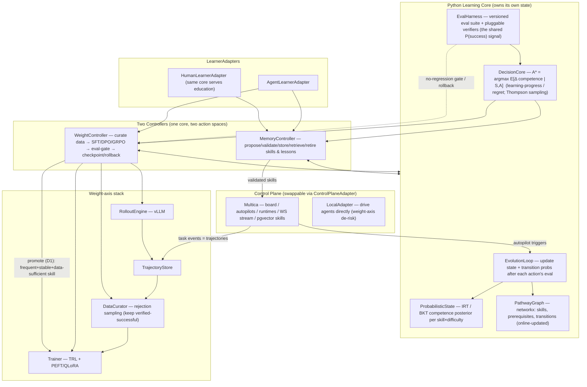

# A Generic Self-Learning Layer for Managed Agents — Research Report

**Engagement:** Pure research brief (`RESEARCH-HANDOVER.md`). No implementation.
**Owner:** nithun@turing.ae · **Date:** 2026-06-22 · **Author:** Claude Code (autonomous research mode)
**Status:** Complete. Go/no-go and reference design below.

> **Calibration legend used throughout.** **[E]** Established — verified against a primary peer-reviewed source or official repo. **[P]** Plausible — directionally verified, exact figure from a secondary source or non-table location. **[S]** Speculative — reasoned estimate, no load-bearing source. **[V]**/**[X]** for Multica claims: Verified / Contradicted against the primary GitHub source. Every quantitative prior-art claim in this report was checked against a fetched primary source by a verification subagent; claims that could not be verified are marked and never asserted.

---

## 1. Executive Summary

### 1.1 The thesis, and the verdict

The brief asks whether a **generic, Python-first "self-learning agents" layer** can wrap a managed-agents control plane (Multica) and make the agents it runs measurably better along two axes — **memory/context-level** (skills, lessons, prompts; weights frozen) and **weight-level** (fine-tuning / RL) — using the concept paper's probabilistic-pathway engine as a single shared **decision core**.

**Headline: GO — build it, in this order, with one correction to the paper's algorithm and one correction to the Multica premise.**

| Component | Verdict | One-line reason |
|---|---|---|
| **Conceptual mapping** (paper → agents) | **GO, with one correction** | The machinery *is* a teacher–student / automatic-curriculum system; it generalizes cleanly — **but the paper's decision rule `A* = argmax P(success\|S,A)` is degenerate for learning and must be replaced by a learning-progress / regret objective.** |
| **Memory-level axis** | **GO (low risk)** | Mechanisms are mature and proven (Voyager, Reflexion, DSPy); cheap, fast, reversible. Turing Agents is already a working instance of the loop. |
| **Weight-level axis** | **CONDITIONAL GO** | Small (1–8B) models *can* be fine-tuned into competent narrow tool-using agents (verified). Gate it on **verifier availability**: GO for domains with a cheap, reliable automatic verifier (code, tool/function-calling, structured tasks); **NO-GO** for open-ended/subjective domains where the only "verifier" is an LLM judge. |
| **Unified decision core** | **GO** | One shared *objective and eval signal* across both axes is sound; use **one core + two pluggable controllers** (different action spaces and timescales), not one controller for everything. |
| **Multica posture** | **HYBRID — layer as a *swappable* backend; do not replace, do not deeply fork** | Multica is real but young (v0.3.x), commercially-restricted-licensed, and its weight-level attach points are unverified/forthcoming. Keep the learning state in *your* service; treat Multica as one `ControlPlaneAdapter`. |

### 1.2 The single most important correction

The paper's decision engine — **`A* = argmax_A P(success | S, A)`** — taken literally, selects the action the learner is **most likely to succeed at**. For a curriculum that is the **wrong objective**: the highest-success action is the one already mastered, which produces **no learning**. The entire automatic-curriculum literature (Teacher–Student Curriculum Learning, PAIRED, Prioritized Level Replay) is unanimous that the controller should optimize **expected learning gain** — *learning progress* (the slope of the competence curve) or *regret* (the gap to a stronger reference) — not immediate success probability **[E]**. The Goldilocks frontier is the action the learner can *almost but not quite* do.

There is a charitable reading (if "success" means success at the *downstream goal* after taking action `A`, then the argmax is correct but underspecified — it needs a credit-assignment model from action to eventual goal success). Either way, the implementable objective is the learning-gain formulation. **This report adopts `A* = argmax_A  E[ Δ competence | S, A ]` as the corrected decision core**, with `P(success)` retained only as the *measurement primitive* that feeds it.

### 1.3 The single most important factual correction

The brief and the repo's prior study disagreed on Multica's license (MIT vs Apache-2.0). **Both are wrong [X].** Multica (`github.com/multica-ai/multica`, created 2026-01-13, ~37,483★, Go 46% / TS 45%, Postgres 17 + pgvector) ships under a **modified Apache-2.0 with commercial-use restrictions** (no hosted/SaaS resale, branding must be preserved); GitHub classifies it as **"Other (NOASSERTION)."** This is load-bearing for any *commercial* layer and is a primary reason the recommendation is "swappable backend," not "fork-and-extend."

---

## 2. Conceptual Analysis — Does the Pathway Framework Generalize to Agents? (§2.A)

### 2.0 What the paper actually is (read this before mapping it)

The concept paper is a **conceptual scaffold, not a rigorous algorithm.** It specifies: a multi-dimensional learner state `S = (skill, mastery, engagement, time, difficulty, context)`; a discrete probabilistic representation `S = {s1,s2,s3}, P(S) = {p1,p2,p3}`; learning as state transition `S_t → A → S_{t+1}`; a graph of states/concepts/activities; a 5-store hybrid data architecture (SQL truth / MongoDB inferred states / Vector embeddings / GraphDB pathways / Redis real-time); a validation engine; an inference engine (reconstruct pathways, retrieve similar states, estimate states, predict outcomes); the decision engine `A* = argmax P(success|S,A)`; a pathway-evolution loop that updates transition probabilities online; and headline results (12,500 learners, 85,000+ interactions, **+18% learning improvement, +23% engagement retention**) stated **without method detail**. It explicitly defers RL, GNNs, and explainability to future work.

The paper supplies the **architecture and vocabulary**; it does **not** supply the probabilistic model (no IRT/BKT), the exploration term, the transition-update rule, or any reproducible evaluation. The intellectual substance that makes the mapping work has to be imported from the surrounding literature — which is exactly what makes the "shared decision core" reframe valuable rather than redundant.

### 2.1 A1 — Does it generalize? Where does the analogy break?

**Yes, structurally it generalizes cleanly.** Strip the education vocabulary and the paper's machinery is: *a probabilistic learner-state model + a transition graph + a controller choosing the next action to maximize a success-derived objective + online updates to the model as the learner improves.* That is precisely the structure of a **teacher–student / automatic-curriculum-learning (ACL)** system. The closest formal analog is **Teacher–Student Curriculum Learning** (Matiisen et al. 2017): a Teacher picks the next subtask for a Student to maximize the Student's **learning progress**, re-selecting tasks where performance regresses (anti-forgetting) **[E]**. The paper's "decision engine" is a TSCL teacher; its "pathway evolution loop" is the teacher's online model update.

**Where the analogy breaks — and what to do about each:**

| Dimension | Human learner | Agent learner | Verdict |
|---|---|---|---|
| **Engagement** | A real, churn-driving signal | Agents do not disengage | **Drop it** as a state dimension; optionally reinterpret as the controller's **exploration term** (the brief's own suggestion). The paper's +23% "engagement retention" result has no agent analog. |
| **State observability** | Mastery is **latent** — must be inferred from sparse, noisy behavior | Competence is **directly measurable** by running an eval | **Strict advantage for agents.** The "state inference engine" becomes far more reliable. Still keep a *probabilistic* estimate (IRT/BKT over eval items) because evals are finite and you want calibrated uncertainty for exploration. |
| **Checkpoint / rewind** | Impossible | Trivial (snapshot weights + memory) | **Strict advantage.** Enables counterfactual A/B of a learning action and safe rollback — impossible with humans. This is why the agent setting is *safer*, not just analogous. |
| **Non-stationarity** | Student drifts slowly | Memory axis: slow; **weight axis: fast** (each fine-tune shifts the policy) | **New hazard the paper ignores.** Re-estimate state after each weight update; prefer on-policy/recent data; gate on no-regression (catastrophic forgetting). |
| **Decision objective** | `argmax P(success)` reads as "pick an achievable next step" | Same rule picks the **already-mastered** action → no learning | **Refute the literal rule;** replace with learning-progress/regret (see §1.2). |

**Net:** the generalization holds and is in several respects *easier* for agents (observable state, checkpointing, counterfactual eval). The two things that must change are the **engagement dimension (drop)** and the **decision objective (correct)**.

### 2.2 A2 — State dimensions for an *agent* learner, and how to estimate each

The right state is **not a scalar "mastery"** but a **competence tensor over (skill-type × difficulty × context)**, plus agent-specific quality axes the paper lacks:

| State dimension | Estimator | Notes |
|---|---|---|
| **Per-skill competence** (task-type mastery) | **Item Response Theory** or **Bayesian Knowledge Tracing** over eval items — treat each eval case as an "item," each pass/fail as a response | Gives a posterior mean **and uncertainty**; directly measurable but probabilistic for exploration. The paper's `P(S)` made concrete. |
| **Task difficulty** | IRT item-difficulty (`b` parameter), calibrated from fleet-wide pass rates | This is an **action/context attribute**, not learner state — the controller *selects* it. |
| **Temporal progression** | A monotone experience/version counter | The agent's "generation"; used to detect drift and forgetting. |
| **Tool-call validity** | Schema/execution validation rate | Agent-specific; cheap reliable verifier. |
| **Cost/latency competence** | Tokens/steps/wall-clock to success | The paper omits efficiency entirely; agents must learn to be *cheap*, not just correct. |
| **Calibration / honesty / safety-compliance** | Targeted eval suites | Agent-specific; needed for safe self-modification (§8). |
| ~~Engagement~~ | — | **Dropped** (see A1). |

### 2.3 A3 — One decision core, or two controllers?

**One shared core (objective + eval signal + state model), two pluggable controllers (different action spaces and timescales).** The genuinely reusable abstraction is: *"choose the action that maximizes expected improvement in eval-measured competence, under uncertainty, with exploration."* That objective, the IRT/BKT state model, and the eval harness are **identical across axes.** What differs:

| | Memory axis | Weight axis |
|---|---|---|
| Action space | propose skill / write lesson / optimize prompt / change retrieval | curate trajectory data for skill X / run an SFT–DPO–GRPO step |
| Timescale & cost | seconds–minutes, ~$0 | minutes–days, $1–$1000s |
| Student stationarity | ~stationary over one action | **non-stationary** (policy shifts per update) |
| Natural controller | **contextual bandit / Thompson sampling** | **curriculum/RL controller** with explicit learning-progress tracking + checkpoint/rollback gating |

So the answer to A3 is **"a single core is genuinely reusable, but not a single controller."** This is exactly the `LearnerAdapter` pattern the brief proposes, refined: one `DecisionCore` + one `EvalHarness` + one `ProbabilisticState`, with `MemoryController` and `WeightController` as the two policies that consume them. **Confidence: [E]** on the shared-objective claim (it is the ACL framing); **[P]** that a single codebase cleanly serves both without controller-specific tuning.

---

## 3. Memory/Context-Level Learning — Findings (§2.B)

### 3.1 B1 — State of the art (all figures primary-source verified)

| System | Mechanism | Headline verified result | Flag |
|---|---|---|---|
| **Voyager** (2305.16291) | Ever-growing **skill library** of executable code, stored by description-embedding, retrieved by query-embedding; auto-curriculum; self-verification. Weights frozen (GPT-4 as black box). | **3.3× more unique items, 2.3× longer distances, up to 15.3× faster** tech-tree milestones vs AutoGPT/ReAct/Reflexion; zero-shot transfer to new worlds | **[E]** |
| **Reflexion** (2303.11366) | **Verbal reinforcement** — reflect on failure, store the lesson in episodic memory, condition the next attempt | **HumanEval 91% pass@1** (vs GPT-4 80%); ALFWorld **130/134** (+22% over ReAct) | **[E]** |
| **Generative Agents** (2304.03442) | **Memory stream**; retrieval = `α_recency·recency + α_importance·importance + α_relevance·relevance` (all α=1; recency decay 0.995); periodic reflection | Full architecture **beats human-authored** condition on believability (TrueSkill 29.89 vs 22.95) | **[E]** |
| **MemGPT / Letta** (2310.08560) | OS-style **tiered/virtual context**; LLM pages memory in/out via function calls | Deep-memory retrieval **35.3% → 93.4%** (GPT-4 Turbo) | **[E]** |
| **DSPy** (2310.03714) | **Program, don't prompt**; a compiler/teleprompter optimizes each module's prompts/demos to a metric | Beats few-shot by **>25% (GPT-3.5)**, **>65% (Llama2-13b)**; beats expert prompts by 5–46% | **[E]** |
| **TextGrad** (2406.07496) | **Textual "gradients"** — LLM critiques backpropagated to optimize prompts/solutions/code | GPQA **51% → 55%** (GPT-4o); **~20%** relative gain on LeetCode-Hard | **[E]** |
| **APE / OPRO / PromptBreeder** | LLM-as-optimizer over prompts (propose → score → keep best); evolutionary in PromptBreeder | OPRO: GSM8K up to ~8%, BBH up to 50%; the discovered "Take a deep breath…" prompt **80.2%** vs "Let's think step by step" 71.8% | **[E]** (PromptBreeder 83.9% **[P]**) |

> **Correction logged:** MIPRO is **not** from the DSPy paper; it is Opsahl-Ong et al. 2024 (2406.11695). BootstrapFewShot is the DSPy-paper optimizer.

### 3.2 B2 — How Turing Agents compares: genuinely novel vs reinventable

Turing Agents' `reflect → evolve` loop (`interactions.jsonl` → `retrospective` → new lessons/skills/agents, every self-edit a git commit) is a **file-native (Markdown + Bash) instance of the same loop** as the SOTA above.

- **Genuinely novel / valuable:** (1) **Git-commit reversibility of every self-edit** — a clean, auditable undo for memory-level learning that the research systems lack; (2) **circuit-breaker lanes + `INVARIANTS` fences** — explicit safety governance over self-modification; (3) **evidence thresholds** ("evolve only when a pattern recurs ≥3× or one costly mistake") — a disciplined trigger most auto-improvement loops omit. These are *governance* innovations, and they prefigure exactly what the weight axis will need (§8).
- **Reinventable / behind SOTA:** (1) **No metric-gated validation.** The defining move of Voyager/DSPy/OPRO is *keep the artifact only if a held-out metric improves*. Turing Agents' "keep" gate is human/heuristic ("did this feel useful?"), not an eval delta — this is the single biggest gap. (2) **Keyword/file retrieval, not embedding retrieval** — `MEMORY.md` pointers vs Voyager/Generative-Agents semantic search. (3) **No automated A/B of a lesson's effect.**

**Verdict:** Turing Agents is **novel in reversibility and safety governance, reinventable in mechanism, and missing the metric-validation gate** that makes the research systems rigorous. Closing that gate (route every proposed skill/lesson through the shared `EvalHarness`) is the highest-leverage upgrade and the natural bridge to the unified core.

### 3.3 B3 — The reusable memory-level algorithm (mapped to the paper's engines)

The seven systems collapse to **one five-stage skeleton**, which is also the paper's inference→decision→evolution pipeline with the education vocabulary removed:

```
PROPOSE → VALIDATE (keep only if it helps) → STORE → RETRIEVE (semantic) → SCORE & RETIRE
```

| Skeleton stage | Paper engine | Voyager | Reflexion | DSPy/OPRO/TextGrad | Turing Agents |
|---|---|---|---|---|---|
| **Propose** | (decision → action) | LLM writes a code skill | LLM writes a reflection | optimizer proposes a prompt/demo variant | `retrospective` proposes a lesson/skill |
| **Validate — keep iff it helps** | **Validation Engine** | execute + self-verify | implicit: next-trial success | **explicit held-out metric** | *(gap — human/heuristic)* |
| **Store** | SQL/Mongo/Vector | skill + embedding | episodic buffer | compiled program | `lessons.md` / `skills/` + git |
| **Retrieve — semantic** | **Inference Engine** (retrieve similar states) | description-embedding NN | re-inject reflections | select optimized demos | keyword/`MEMORY.md` |
| **Score & retire** | Evolution loop | overwrite/refine | bounded buffer | prune losing variants | append-and-supersede `L-NNN` |

The reusable contract: **`propose() → validate(metric) → store() → retrieve(query) → score()/retire()`**, with the **validate gate** as the load-bearing stage. This is implemented once in the core's `SkillLibrary` and reused by every memory-level learner (human or agent).

### 3.4 Memory-axis rubric (§4)

| Dimension | Memory-level |
|---|---|
| Reward/eval signal needed | A metric to gate "keep iff it helps" — can be weak/cheap (self-verification, a few held-out cases) |
| Cost per improvement cycle | **~$0** (a few LLM calls); no GPUs |
| Speed to improvement | **Seconds–minutes** |
| Durability of gains | **Moderate** — lives in context/memory; lost if the store is wiped; competes for context window |
| Reversibility / safety | **Excellent** — git revert / drop the artifact (Turing Agents already does this) |
| Data requirements | **Minimal** — single episodes suffice |
| Non-stationarity exposure | **Low** — student ~stationary over one action |
| Observability / debuggability | **Excellent** — artifacts are human-readable text/code |
| Maturity of OSS tooling | **High** — DSPy, Letta, LangGraph memory, vector DBs |

---

## 4. Weight-Level Learning — Findings (§2.C)

### 4.1 C1 — Can small (1–8B) LLMs be fine-tuned into agents? (verified)

**Yes, for narrow tool-using / function-calling / format-adherent agency — often matching or beating frontier models *on that scoped skill* — while NOT matching frontier general reasoning. Confidence: [E].**

| Evidence | Verified result | Flag |
|---|---|---|
| **xLAM-7B / APIGen** (2406.18518) | **85.65 on Berkeley Function-Calling Leaderboard, rank 6, surpassing GPT-4-turbo (85.59) and GPT-4o (80.53)**; xLAM-1B beats GPT-3.5-Turbo & Claude-3-Haiku. *Neutral leaderboard — strongest evidence.* | **[E]** |
| **Gorilla-7B** (2305.15334) | Beats GPT-4 by **+20.43%** on APIBench; hallucination 5.40% vs GPT-4 78.65% | **[E]** |
| **ToolLLaMA-7B** (2307.16789) | Pass rate **≈ ChatGPT** over 16,464 real APIs using DFSDT | **[E]** |
| **Lumos-7B** (2311.05657) | **Beats GPT-4 by +5.0%** on Mind2Web step success | **[E]** |
| **FireAct** (2310.05915) | Llama2-7B HotpotQA **14.8 → 26.2 EM (+77%)** from only **500 GPT-4 trajectories** | **[E]** (brief mis-attributed this to GPT-3.5; it is Llama2-7B) |
| **Toolformer-6.7B** (2302.04761) | Beats GPT-3 **175B** on factual+math tool tasks (but trails on open-domain QA) | **[E]** |
| **AgentTuning / AgentLM** (2310.12823) | AgentLM-70B reaches GPT-3.5-turbo level on **unseen** agent tasks while retaining aggregate general ability | **[E]** |

**The calibrated limits:** the wins are **narrow and skill-specific**; general reasoning is **preserved, not elevated** (AgentLM-70B MMLU even dips 62.1→59.5); many "beats GPT-4" claims (NexusRaven, Hermes-2-Pro) are **vendor self-reported [P]**, not neutral leaderboards — weight BFCL/APIBench/ToolEval results above those.

### 4.2 C2 — What produces good agentic trajectory data?

**The dominant, best-evidenced recipe is: distill from a strong model → over-generate → reject-sample (keep only verified-successful trajectories) → fine-tune on the survivors.** The *filter* is the active ingredient.

- **Rejection-sampling / distillation:** STaR (2203.14465), Rejection-sampling Fine-Tuning (2308.01825), AgentTuning, and Llama-2's RLHF all share this mechanism; STaR adds *rationalization* (re-prompt failures with the answer) **[E]**.
- **Synthetic + execution-verification scales it:** APIGen's three-stage gate (format → **execution** → semantic) scales to **60k verified entries** and yields the 7B-beats-GPT-4 result **[E]**.
- **Human traces are largely displaced** — they survive as a small seed; the high-value human effort is the **verifier and seed prompts**, not hand-writing trajectories.
- **Quality threshold — a small, ruthlessly-filtered set beats a large noisy one:** AgentTuning lifts a 70B to GPT-3.5 level on unseen tasks with only **~1,866** reward-filtered trajectories; STaR closes a 30× model-size gap with tiny bootstrapped sets; RFT shows **path diversity within the kept set** drives gains and returns diminish as the base model strengthens **[E]**.

**The elegant consequence for unification (see §5):** the **memory axis generates exactly the data the weight axis consumes.** Every validated skill execution and successful trajectory the memory loop produces is a reject-sampled training example. The two axes are a producer/consumer pair, not two separate data problems.

### 4.3 C3 — Methods, infra, and realistic cost envelopes

**Methods (verified):** LoRA — 10,000× fewer trainable params, 3× less GPU memory, no inference latency (2106.09685) **[E]**. **QLoRA** — 4-bit NF4 + paged optimizers; **finetune a 65B model on a single 48GB GPU**; Guanaco at **99.3% of ChatGPT in 24 GPU-hours** (2305.14314) **[E]** — *the key cost anchor*. DPO — RL-free preference alignment, no reward model, no on-policy sampling (2305.18290) **[E]**. GRPO — critic-free PPO variant, drops the value model to cut memory; DeepSeekMath-7B 51.7% MATH (2402.03300) **[E]** (the "~50% memory cut" is a secondary characterization **[P]**).

**Infra (verified):** TRL (SFT/DPO/GRPO trainers) **[E]**; PEFT (adapter umbrella) **[E]**; Axolotl (config-driven, FSDP/DeepSpeed multi-GPU) **[E]**; **vLLM** — PagedAttention, **2–4× over FasterTransformer/Orca** in the SOSP paper / up to 24× over vanilla HF on the blog (2309.06180) **[E]**, critical because **trajectory rollout dominates RL/data-gen wall-clock**; Unsloth — "2× faster, 70–80% less VRAM" but **vendor self-reported [P]**.

**Cost envelopes (feasibility [E]; dollar figures [S] — June-2026 rates are volatile):**

| Scenario | What's feasible | Order-of-magnitude cost |
|---|---|---|
| **Single GPU (24–48GB), QLoRA** | 7B/13B comfortably; **33B on 24GB**, **65B on 48GB**. Full-precision 7B FT does **not** fit — QLoRA/LoRA is the path. | A 7B LoRA SFT ≈ 3–24 GPU-hours → **~$2–$20** on a marketplace 4090/A6000 **[S]** |
| **Small cluster (8×A100/H100)** | **Full fine-tune** of 7–8B becomes routine (FSDP/ZeRO); RL/GRPO with a dedicated vLLM rollout server | SFT: tens–low-hundreds of $; **RL/GRPO run: hundreds–low-thousands of $** **[S]** |

**Implication:** the **memory axis is ~free**; the **weight axis is cheap for SFT, materially expensive for RL.** This asymmetry drives the promotion economics in §5.

### 4.4 C4 — "Small teacher for a bigger student": where the boundary is

**Established boundary: a small model can supply a useful *signal* to a larger student — but cannot transfer *knowledge* into it.**

- **Works (signal):** small models as **curriculum teachers** (TSCL's teacher is tiny relative to the student) **[E]**; as **verifiers / process-reward models** (a smaller PRM still gives a denser, harder-to-game signal — "Let's Verify Step by Step," 2305.20050) **[E]**; as **routers**; and as **same-size or smaller AI-feedback judges** (RLAIF shows even same-size AI feedback beats the SFT baseline) **[E]**.
- **Fails (knowledge):** **backward distillation** — you cannot distill capability *up* from a weaker model into a stronger one; the strong student would only be dragged toward the weak teacher's ceiling.

So in this architecture a small model is a legitimate **controller / verifier / data-curator**, never a teacher-by-imitation for a stronger policy.

### 4.5 Weight-axis rubric (§4)

| Dimension | Weight-level |
|---|---|
| Reward/eval signal needed | A **strong, reliable, hard-to-game verifier** — this is the binding constraint (§8 H1) |
| Cost per improvement cycle | **$1–$20 (SFT)** to **$100s–$1000s (RL)** per cycle |
| Speed to improvement | **Minutes (SFT) – days (RL)** |
| Durability of gains | **High** — baked into weights; survives context wipes; no per-call context cost |
| Reversibility / safety | **Good but heavier** — checkpoint/rollback (not git); risk of catastrophic forgetting |
| Data requirements | **Moderate–high** — needs verified trajectories (hundreds–tens of thousands) |
| Non-stationarity exposure | **High** — each update shifts the policy; must re-estimate state |
| Observability / debuggability | **Low** — weight deltas are opaque; only behavior is observable |
| Maturity of OSS tooling | **High** — TRL, PEFT, Axolotl, Unsloth, vLLM, bitsandbytes |

---

## 5. Unification — One Decision Core Across Both Axes (§2.D)

### 5.1 D1 — When to promote a memory-level skill to a weight-level fine-tune

Promote when the **amortized inference savings + reliability gain exceed the one-time training cost.** Concretely, promote a skill/behavior to weights when **all** of these hold:

1. **Frequency** — it is used often enough that the per-call context cost (carrying the skill/lesson in the prompt) and retrieval latency, summed over expected calls, exceed the fine-tune cost.
2. **Stability** — the behavior is unlikely to change soon (else the tune is wasted; volatile skills stay in memory where they're cheap to edit).
3. **Context pressure** — the skill library / lesson set has grown large enough that not all relevant artifacts fit in context, so retrieval starts missing — the classic memory-axis ceiling.
4. **Data sufficiency** — enough **verified** trajectories exist (the memory loop has already produced them via §4.2).
5. **Eval-proven reliability** — the shared `EvalHarness` shows the behavior is reliable enough to bake in irreversibly-ish.

**Do not promote** rare, volatile, or unverifiable skills — keep them in memory (cheap, reversible, debuggable). The promotion is a **one-way ratchet** chosen conservatively because weights are harder to revert than a git commit.

### 5.2 D2 — A shared reward/eval signal and an eval-in-the-loop harness

**Yes — both axes share one signal: `P(success | S, A)` measured by one `EvalHarness`.** This is the keystone of the whole design. The harness:

- defines a **versioned eval suite per skill × difficulty** (the "items" for IRT/BKT);
- exposes **pluggable verifiers** ranked by reliability: code execution / unit tests → math answer-check → tool-call schema/execution validation → simulator task-success → (last resort, caveated) LLM-judge;
- returns a competence posterior that **both controllers consume** — the memory controller to gate "keep iff it helps," the weight controller to compute learning progress and to gate deployment.

The reward-signal bottleneck (§8 H1) therefore applies **identically to both axes** — which is convenient: solve the verifier once, both axes benefit; fail to solve it, both axes fail. There is no axis-specific reward to invent.

### 5.3 D3 — Handling non-stationarity (the student changing under the controller)

The paper assumes a quasi-stationary learner; agents violate this, **asymmetrically**:

- **Memory axis (slow drift):** the policy is fixed weights; memory edits change behavior gradually. A contextual bandit with mild discounting is adequate.
- **Weight axis (fast drift):** every SFT/DPO/GRPO step shifts the policy, so **state estimated before the update is stale after it.** Mitigations: re-run the relevant evals to **re-estimate competence after each update**; prefer **on-policy / recent** trajectory data; bound the update (KL/regret constraints) to limit drift; and **gate on no-regression** — if any monitored competence drops (catastrophic forgetting), **roll back to the checkpoint.** This is where the agent's checkpoint/rewind advantage (A1) pays off directly.

### 5.4 Layer-vs-replace is mirrored at the algorithm level

Unification is **"one core, two controllers"** (§2.3), not "one controller." The shared, reused-once components are `ProbabilisticState`, `PathwayGraph`, `EvalHarness`, and the corrected `DecisionCore` objective. The axis-specific components are the two controllers and their action executors. **Confidence:** the shared-eval claim is **[E]** (it is the same `P(success)`); the clean single-core implementation is **[P]** pending a real pilot.

---

## 6. Multica Integration Analysis (§2.E)

### 6.1 E1 — Multica's extension surface (verified against the primary source)

Multica is **real and self-hostable** (high confidence), but described in the brief at "marketing granularity." Verified attach points:

| Surface | Status | Use as the learning layer's… |
|---|---|---|
| **Autopilots** (cron / webhook / manual; each creates an issue and routes it) | **[V]** | **Trigger** for learning routines (nightly "evolve," post-task data harvest) |
| **WebSocket event stream** (`gorilla/websocket`; "real-time progress streaming") | **[V]** | **Ingest** — task lifecycle events = raw **trajectory data** |
| **CLI / daemon** (`multica daemon start`, `multica issue create`) | **[V]** | **Actuator** — enqueue eval/curriculum tasks back into the board |
| **pgvector skill store** ("reusable skills," vector search) | **[V]** (store) | **Write-back** target for memory-level skills |
| **Runtimes** (local daemons + auto-detect CLIs; cloud "forthcoming") | **[V] local / [P] cloud** | **The weight-axis attach point** — *if* it can register a custom fine-tuned model endpoint |
| **Task lifecycle** (enqueue/claim/start/complete/fail) | **[V]** states / **[P]** formal hook API | Episode boundaries for trajectory segmentation |
| **Agent lifecycle hooks / board-issue event schemas** as a formal API | **[P]/UNVERIFIED** | Must be validated against source before depended on |
| **SKILL.md / agentskills.io adherence** | standard is real **[V]**; Multica's use of it **UNVERIFIED** | Don't assume portability format until confirmed |

**Key gap:** the **memory-axis** attach points (events in, skills out, autopilot triggers) are concretely real. The **weight-axis** attach point (swap the model an agent runs on for a fine-tuned checkpoint) depends on the **runtime** abstraction accepting custom endpoints — which is **unverified and partly forthcoming.** You can layer the memory axis on Multica today; you **cannot yet bet the weight axis on it.**

### 6.2 E2 — Three postures evaluated

| Posture | Integration effort | Control over learning | Blast radius | Time-to-first-value | Long-term ceiling |
|---|---|---|---|---|---|
| **(a) Layer/plugin on Multica** (the brief's starting hypothesis) | Low | **Insufficient for weights** (can't reliably control model swap / eval-gating) | Low | **Fast** (memory axis) | Capped by Multica's APIs & license |
| **(b) Full replacement** (Python-native control plane — the user's original framing) | **Very high** (rebuild board/squads/runtimes/multi-provider) | Total | High | Slow | High, but you're now maintaining a control plane, not a learning layer — violates MVP |
| **(c) Hybrid — Multica orchestrates, a standalone Python service owns learning** | Medium | **Full over learning; borrows orchestration** | Medium | Fast (memory) → staged (weights) | **High** — learning state is yours; control plane is swappable |

### 6.3 E3 — Recommendation: HYBRID, with a hard decoupling — and the resolution of "replace vs layer"

**Build a control-plane-agnostic Python learning service that owns its own state (the paper's stores) and treats Multica as one pluggable `ControlPlaneAdapter`. Do not replace Multica; do not deeply fork it.**

This resolves the brief's explicit open question (the user selected "layer on Multica" but originally said "replace Multica"):

- **Layering suffices for the data flow.** Multica's event stream supplies trajectories, its skill store receives memory-level outputs, its autopilots trigger your routines. The learning loop does **not** need to own orchestration — so a full replacement is unjustified (and would mean maintaining a 37k-star Go/Next.js control plane, the opposite of MVP).
- **But the learning loop demands control Multica cannot reliably cede today** — specifically over (1) **which model weights an agent runs** (fine-tuned checkpoints), (2) **rollout for trajectory generation**, and (3) **eval-gating deployment**. The runtime hook that would allow (1) is unverified/forthcoming. Therefore the **source of truth for learning state — competence estimates, skill library, trajectory store, eval results — must live in your service, not in Multica.**
- **The license seals it.** Multica's **modified-Apache NOASSERTION (commercial-restricted, no hosted resale) [X]** plus **v0.3.x volatility (1,036 open issues, 200+ open PRs)** make any deep fork a legal and maintenance liability. A thin adapter against its public CLI/WebSocket/autopilot surface keeps you on the safe side of the license and insulated from its churn.

**So: neither replace nor surrender — make Multica a swappable backend.** Concretely, ship `ControlPlaneAdapter` as the interface and `MulticaAdapter` as the first implementation; a `LocalAdapter` (drive agents directly) de-risks the weight axis until Multica's runtime model-swap is verified. This also matches Turing Agents' own provider-agnostic philosophy and the `LearnerAdapter` pattern already in the profile.

---

## 7. Recommended Reference Architecture (§2.F)

### 7.1 System diagram



### 7.2 F1 — The Python library shape (design, not code)

A single core package, `pathways/` (illustrative interfaces — **design sketch, no implementation**):

- **`ProbabilisticState`** — competence posterior per `(skill, difficulty, context)` via IRT or Beta-Bernoulli BKT. `update(item, outcome)`, `posterior(skill) -> (mean, var)`. Makes the paper's `P(S)` concrete.
- **`PathwayGraph`** — `networkx.DiGraph` of skills/tasks; edges = prerequisites + transitions with online-updated probabilities. `next_candidates(state)`, `update_transition(a, b, outcome)`.
- **`EvalHarness`** — the shared reward signal. `score(learner, skill) -> SuccessEstimate`; registry of `Verifier`s (`CodeExecVerifier`, `SchemaVerifier`, `TaskSuccessVerifier`, `LLMJudgeVerifier[caveated]`) ordered by reliability.
- **`DecisionCore`** — `choose(state, actions) -> action` maximizing **expected learning gain** (learning-progress or regret), via Thompson sampling / contextual bandit. **Pluggable `Objective`** so the corrected rule is explicit and the paper's literal `argmax P(success)` is *not* the default.
- **`EvolutionLoop`** — orchestrates `decide → act → eval → update`; the paper's evolution loop.
- **`LearnerAdapter`** (ABC) → `AgentLearnerAdapter`, `HumanLearnerAdapter`. The agent adapter wires the two controllers:
  - **`MemoryController`** — implements the §3.3 skeleton (`propose/validate/store/retrieve/retire`) over a `SkillLibrary` (embedding-indexed).
  - **`WeightController`** — `TrajectoryStore` → `DataCurator` (rejection sampling) → `Trainer` (TRL + PEFT/QLoRA) → eval-gate → checkpoint/rollback; `RolloutEngine` (vLLM) for data-gen.
- **`ControlPlaneAdapter`** (ABC) → `MulticaAdapter` (consume WS events, write skills to pgvector, enqueue via CLI/autopilots), `LocalAdapter`.

### 7.3 F2 — Data / ML / serving stack

- **Data (start lean, grow into the paper's 5 stores):** Postgres + **pgvector** covers SQL-truth *and* embeddings; **networkx** in-process covers the graph (→ Neo4j only at scale); Redis optional for real-time. **Do not stand up all five stores on day one** (see F3).
- **ML:** HF Transformers, **PEFT/QLoRA**, **TRL** (SFT/DPO/GRPO), bitsandbytes, **vLLM** (rollout), optionally Unsloth/Axolotl.
- **Eval/serving:** vLLM for inference; an eval harness (custom, or `inspect`/`lm-eval-harness`-style) wrapping the verifiers.
- **State modeling:** `pyro`/`numpyro` or a lightweight BKT implementation for `ProbabilisticState`.

### 7.4 F3 — Dependency, licensing, and maintenance risks

- **Over-engineered data layer:** the paper's 5-store hybrid is a maintenance trap for an MVP. **Collapse to Postgres+pgvector + networkx (+ Redis if needed).** Defer Mongo/Neo4j until scale demands them. **[S]** engineering judgment.
- **Licensing:** the ML stack (Transformers/PEFT/TRL Apache-2.0, vLLM Apache-2.0, networkx BSD) is permissive and release-safe. **Multica's NOASSERTION license is the one real constraint** — confine the dependency to a thin adapter against public interfaces; verify obligations before any commercial release.
- **Reward-signal & non-stationarity** are the architectural risks, carried in §8.
- **Compute** for the weight axis is real but bounded (§4.3); the memory axis is ~free.

---

## 8. Risk Register (§2.H)

| # | Risk | Sev | Likelihood | Mitigation |
|---|---|---|---|---|
| **H1** | **Reward-signal bottleneck** — without a cheap, reliable, hard-to-game verifier, the loop amplifies garbage | **Critical** | High (for open-ended domains) | **Scope target domains to those with executable verifiers** (code/tests, math, tool-schema, sim-success). Treat verifier availability as a **GO-condition** per domain, not an afterthought. For soft-judge domains expect **saturation** (Self-Rewarding LMs saturate; Meta-Rewarding needed a judge-of-the-judge) and **reward hacking** (Gao et al., reward-model overoptimization 2210.10760); budget anti-hacking constraints (KL/regret bounds, process-level/ensembled verifiers, human spot-checks). **[E]** |
| **H2** | **Unsafe self-modification / self-tuning** | High | Medium | **Reversibility on both axes** — git for memory (Turing Agents already), **checkpoint/rollback for weights**; **eval-gate before deployment**; **circuit-breaker lanes + INVARIANTS fences** extended to the weight axis; **no-regression gate** on every monitored competence (catastrophic-forgetting guard). |
| **H3** | **Cost, reproducibility, eval rigor** (weight axis) | Medium | Medium | **Versioned eval suites**; fixed seeds where possible; per-domain **cost budgets**; promote to weights conservatively (D1) since weight reverts are heavier than git reverts; log every training run's data lineage. |
| H4 | **Non-stationarity** breaks state estimates after each update | Medium | High (weight axis) | Re-estimate competence post-update; on-policy/recent data; bounded updates (§5.3). |
| H5 | **Multica volatility / license** (v0.3.x, 1,036 open issues, NOASSERTION) | Medium | Medium | Thin swappable adapter; pin a version; `LocalAdapter` fallback; legal review before commercial release. |
| H6 | **Over-claiming from the concept paper** (its +18%/+23% are unmethodized; its decision rule is degenerate) | Low | — | Treat the paper as a scaffold; **adopt the corrected objective**; do not cite its results as evidence. |

---

## 9. Competitive Positioning (§2.G)

### 9.1 G1 — Who is actually building "agents that learn"?

**As a *platform*: essentially no one (verified).** The landscape splits cleanly:

- **Control planes orchestrate but do not learn:** OpenHands (MIT, ~68k★), Devin (proprietary), CrewAI, LangGraph, Microsoft Agent Framework (AutoGen+Semantic Kernel, v1.0), MetaGPT, OpenAI Agents SDK, **Multica**. None ships a persistent self-improvement loop. Multica's "compound skills" is the only commercial gesture toward learning — but it's a pgvector skill *library*, not a closed loop, and it's unproven (5 months old).
- **Learning loops exist only as research/libraries:** **Voyager** (skill library), **ADAS** (2408.08435 — a meta-agent that *programs better agents*, the direct analog of Turing Agents' `agent-smith`), **Agent Workflow Memory** (2409.07429, +24.6%/+51.1% on Mind2Web/WebArena), **DSPy** (self-improving pipelines). The "Self-Evolving Agents" survey (2507.21046 — *the brief's cited id is correct* **[V]**) catalogs the mechanisms.
- **Automated-curriculum / agent-tuning *as a service*: empty as a product category (verified "could not find").**

### 9.2 G2 — The defensible white space

**The combination of (a) a managed-agents control plane + (b) a generic, persistent learning loop spanning BOTH memory-level AND weight-level improvement, sharing one eval signal, is currently unoccupied.** The research proves each mechanism independently; the platforms provide the attach surface; **nobody has fused them as a product.** The sharpest novelty is the **memory+weight combination tied to a live control plane** — existing work is overwhelmingly memory-level; weight-level continuous improvement bound to a running agent fleet is where the verified landscape thins to near-zero.

**Defensibility caveats (calibrated):** the moat is the **loop + data flywheel + eval harness**, not the idea (Voyager/ADAS/AWM/DSPy are all reproducible). The genuinely hard, defensible parts are: a reliable **multi-domain verifier suite**, the **promotion economics** between axes, and the **safety/reversibility governance** (where Turing Agents already has a head start).

---

## 10. Annotated Bibliography

*One-line takeaway + confidence per source. All URLs are arXiv abstract pages or official repos; every quantitative claim was fetched and verified.*

**Conceptual core / curriculum (the decision engine's real lineage)**
- Matiisen et al. 2017, **Teacher–Student Curriculum Learning**, arXiv:1707.00183 — *the* formal analog of the paper's decision engine; teacher picks tasks to maximize student learning progress. **[E]**
- Portelas et al. 2020, **ACL survey**, arXiv:2003.04664 — umbrella framing: controller shapes the task distribution to maximize learning. **[E]**
- Dennis et al. 2020, **PAIRED / UED**, arXiv:2012.02096 — regret-based adversarial curriculum at the frontier of solvability. **[E]**
- Wang et al. 2019, **POET**, arXiv:1901.01753 — open-ended environment/agent coevolution. **[E]**
- Jiang et al. 2021, **Prioritized Level Replay**, arXiv:2010.03934 (+ Robust PLR 2110.02439 **[P]**) — curriculum by replaying high-learning-potential tasks; >76% test-return gain. **[E]**

**Memory-level learning (weights frozen)**
- Wang et al. 2023, **Voyager**, arXiv:2305.16291 — ever-growing executable skill library; 3.3×/2.3×/15.3× over baselines. **[E]**
- Shinn et al. 2023, **Reflexion**, arXiv:2303.11366 — verbal RL; HumanEval 91% vs GPT-4 80%. **[E]**
- Park et al. 2023, **Generative Agents**, arXiv:2304.03442 — recency·importance·relevance memory retrieval; beats human-authored believability. **[E]**
- Packer et al. 2023, **MemGPT/Letta**, arXiv:2310.08560 — OS-style tiered memory; DMR 35.3%→93.4%. **[E]**
- Khattab et al. 2023, **DSPy**, arXiv:2310.03714 — compile/optimize LM programs to a metric; +25–65% over few-shot. **[E]**
- Opsahl-Ong et al. 2024, **MIPRO**, arXiv:2406.11695 — multi-stage prompt+demo optimizer (corrects the brief's DSPy attribution). **[E]**
- Yuksekgonul et al. 2024, **TextGrad**, arXiv:2406.07496 — textual gradients; GPQA 51→55. **[E]**
- Zhou et al. 2022 **APE** (2211.01910); Yang et al. 2023 **OPRO** (2309.03409, "Take a deep breath" 80.2%); Fernando et al. 2023 **PromptBreeder** (2309.16797, 83.9% **[P]**) — LLM-as-optimizer over prompts. **[E]**
- Wang et al. 2024, **Agent Workflow Memory**, arXiv:2409.07429 — induces reusable workflows from experience; +24.6%/+51.1%. **[E]**

**Weight-level: small models as agents + data + methods**
- Liu et al. 2024, **APIGen / xLAM**, arXiv:2406.18518 (+ xLAM 2409.03215) — execution-verified synthetic data; **xLAM-7B beats GPT-4-turbo on BFCL**. **[E]**
- Patil et al. 2023, **Gorilla**, arXiv:2305.15334 — 7B beats GPT-4 +20.43% on APIBench; hallucination crushed. **[E]**
- Qin et al. 2023, **ToolLLM/ToolBench**, arXiv:2307.16789 — 16,464 real APIs; ToolLLaMA-7B ≈ ChatGPT via DFSDT. **[E]**
- Yin et al. 2023, **Lumos**, arXiv:2311.05657 — 7B beats GPT-4 +5.0% on Mind2Web. **[E]**
- Chen et al. 2023, **FireAct**, arXiv:2310.05915 — Llama2-7B +77% on HotpotQA from 500 trajectories (brief mis-attributed to GPT-3.5). **[E]**
- Zeng et al. 2023, **AgentTuning/AgentLM**, arXiv:2310.12823 — ~1,866 reward-filtered trajectories lift 70B to GPT-3.5 level on unseen tasks. **[E]**
- Schick et al. 2023, **Toolformer**, arXiv:2302.04761 — 6.7B self-teaches tool use, beats GPT-3 175B on factual/math. **[E]**
- Zelikman et al. 2022, **STaR**, arXiv:2203.14465 — bootstrap reasoning via rejection sampling; closes a 30× model-size gap. **[E]**
- Yuan et al. 2023, **Rejection-sampling FT / "Scaling Relationship"**, arXiv:2308.01825 — path diversity in the kept set drives gains. **[E]**

**Methods & infra**
- Hu et al. 2021, **LoRA**, arXiv:2106.09685 — 10,000× fewer trainable params, no inference latency. **[E]**
- Dettmers et al. 2023, **QLoRA**, arXiv:2305.14314 — 65B on a single 48GB GPU; Guanaco 99.3% of ChatGPT in 24 GPU-hrs (**key cost anchor**). **[E]**
- Rafailov et al. 2023, **DPO**, arXiv:2305.18290 — RL-free preference alignment, no reward model. **[E]**
- Shao et al. 2024, **GRPO/DeepSeekMath**, arXiv:2402.03300 (+ DeepSeek-R1 2501.12948) — critic-free PPO, memory-saving. **[E]**
- Kwon et al. 2023, **vLLM/PagedAttention**, arXiv:2309.06180 — 2–4× over FasterTransformer/Orca; rollout accelerator. **[E]**
- HF **TRL**, **PEFT** (official docs); **Axolotl** (config-driven, FSDP) **[E]**; **Unsloth** (2× faster / 70–80% less VRAM, **vendor-reported [P]**).

**Reward / self-improvement / safety**
- Lightman et al. 2023, **Let's Verify Step by Step (PRM)**, arXiv:2305.20050 — process > outcome supervision; 78% MATH. **[E]**
- Yuan et al. 2024, **Self-Rewarding LMs**, arXiv:2401.10020 — model judges itself; beats GPT-4-0613 on AlpacaEval 2.0 — **but saturates**. **[E]**
- Wu et al. 2024, **Meta-Rewarding**, arXiv:2407.19594 — judge-of-the-judge to fight saturation. **[E]**
- Lee et al. 2023, **RLAIF**, arXiv:2309.00267 — AI feedback matches RLHF; same-size feedback still helps (exact %s **[P]**). **[E]**
- Bai et al. 2022, **Constitutional AI**, arXiv:2212.08073 — self-critique against principles. **[E]**
- Gao et al. 2022, **Reward-model overoptimization scaling laws**, arXiv:2210.10760 — proxy reward is gameable in the limit; bigger RMs don't fix it. **[E]**

**Platforms / positioning**
- **Multica**, github.com/multica-ai/multica — real, v0.3.x, ~37.5k★, Go+Next.js+Postgres/pgvector, **modified-Apache NOASSERTION (commercial-restricted)** **[V]/[X]**.
- **OpenHands** (MIT), **Microsoft Agent Framework** (v1.0), **CrewAI**, **LangGraph** — orchestration, no learning loop. **[V]/[P]**
- Hu et al. 2024, **ADAS**, arXiv:2408.08435 — meta-agent designs agents (analog of `agent-smith`). **[V]**
- **Self-Evolving Agents survey**, arXiv:2507.21046 — what/when/how/where to evolve. **[V]**
- **agentskills.io** — real open Agent Skills standard (Anthropic, 2025-12-18); Multica's adherence **UNVERIFIED**.

---

## 11. Open Questions & Recommended Next Experiments

The smallest experiments that would de-risk a build decision, in priority order:

1. **Verifier-availability probe (de-risks H1 — do this first, ~days, ~$0).** Pick one narrow pilot domain with a *cheap executable verifier* — recommend **tool/function-calling agents** (schema + execution validation, the xLAM/BFCL setting). Confirm you can score `P(success)` reliably and cheaply on a held-out suite. **If you cannot build a trustworthy verifier here, the weight axis is NO-GO and you should ship memory-only.**

2. **Memory-axis MVP on the shared eval gate (~1–2 weeks, ~$0).** Retrofit Turing Agents' `reflect→evolve` loop with the missing **metric-validation gate**: route every proposed skill/lesson through the `EvalHarness`, keep iff the competence posterior improves. This proves the §3.3 skeleton end-to-end on a real task and is immediately useful regardless of the weight-axis decision.

3. **Corrected-objective A/B (~days, ~$0).** On a toy skill graph, compare the paper's literal `argmax P(success)` against the corrected `argmax E[Δcompetence]` (learning-progress). Expectation: the literal rule stalls (picks mastered tasks); the corrected rule climbs the frontier. Confirms §1.2 empirically before it's load-bearing.

4. **Weight-axis single-GPU pilot (~1 week, ~$10s).** On the pilot domain, harvest memory-axis successful trajectories → rejection-sample → QLoRA-SFT a 7B (single 24GB GPU) → eval-gate → measure competence delta and the **promotion break-even** (D1). Validates the producer/consumer coupling (§4.2) and the cost envelope (§4.3).

5. **Multica adapter spike (~days).** Validate the *actual* event/hook API and whether a **runtime can register a custom fine-tuned endpoint** (the unverified weight-axis attach point, E1). Determines whether the weight axis can ever ride Multica or must stay on `LocalAdapter`.

6. **Non-stationarity / forgetting harness (after #4).** After a fine-tune, re-run the full competence suite; measure regressions; exercise the rollback gate (H4/§5.3).

**Standing open questions for the owner:** (a) the **pilot domain** and its verifier (drives everything); (b) the **compute budget** for the weight axis; (c) whether the eventual product is **open-source or commercial** (decides how much the Multica NOASSERTION license actually binds).

---

### Acceptance-criteria check

- [x] Every §2 question (A–H) answered with evidence + confidence.
- [x] Both §4 rubrics filled for both axes (§3.4, §4.5).
- [x] Defended layer / replace / **hybrid** recommendation for Multica (§6.3).
- [x] Clear **go / no-go** with reasoning (§1).
- [x] Reference-architecture diagram (Mermaid) + Python library shape, **design only** (§7).
- [x] Annotated bibliography with calibrated confidence flags (§10).
- [x] No code written; no claim asserted from memory without source verification.
